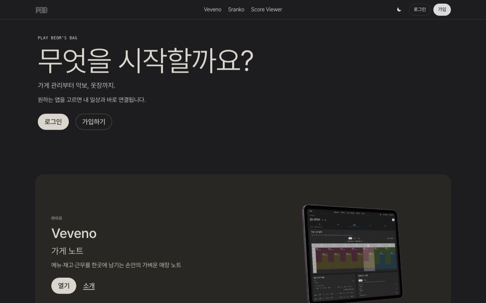
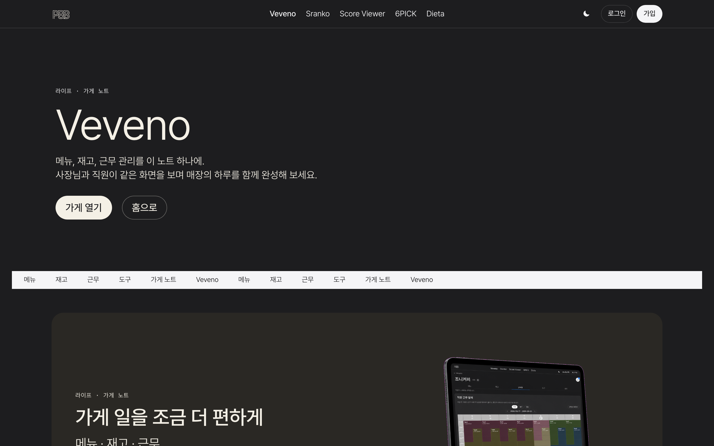
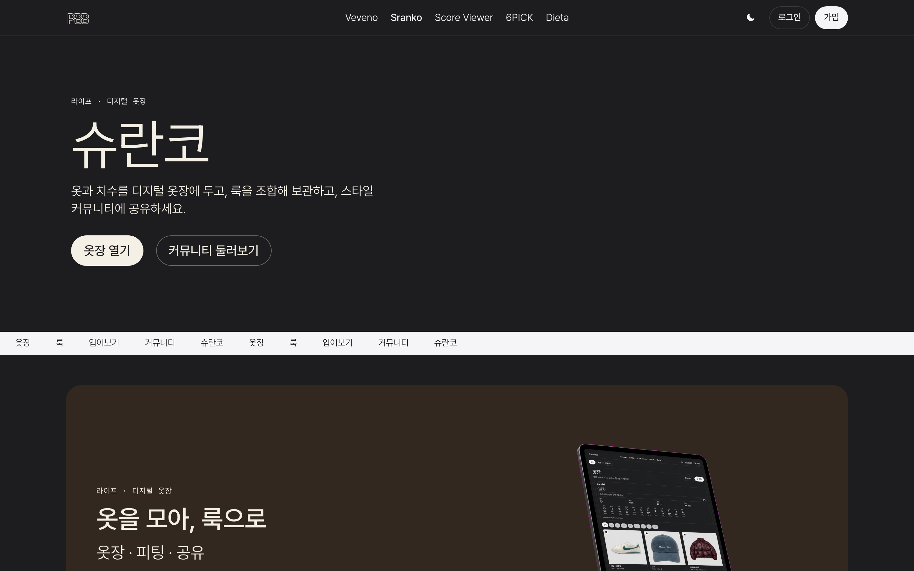
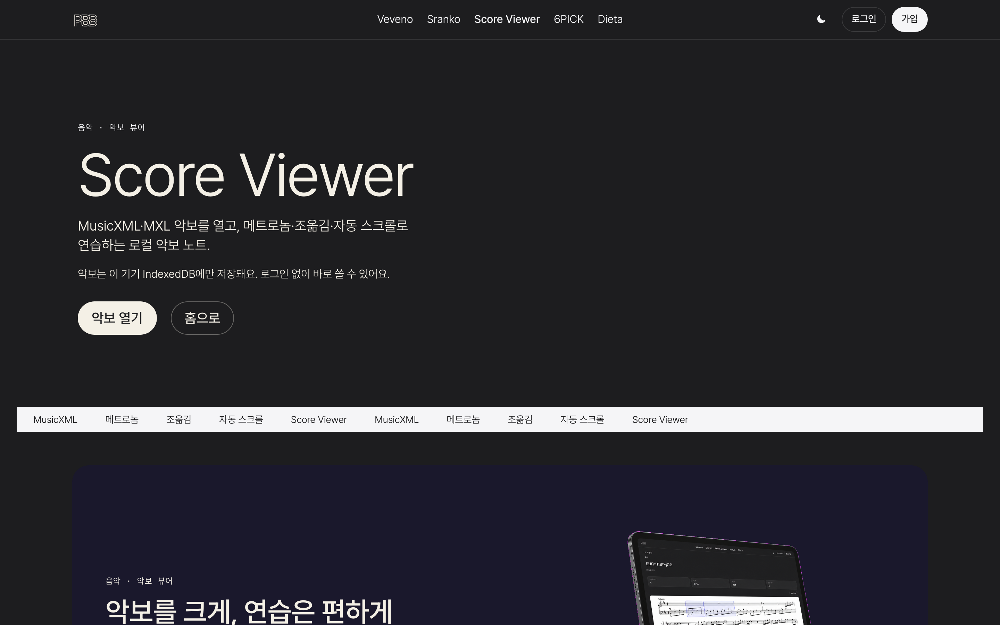
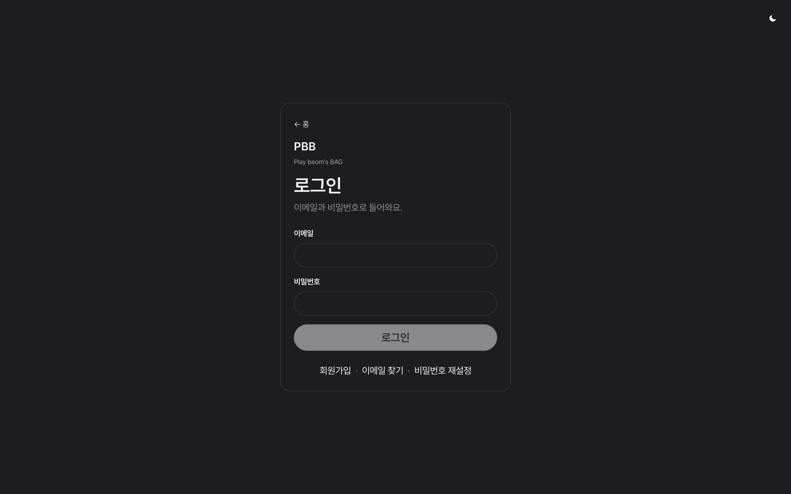
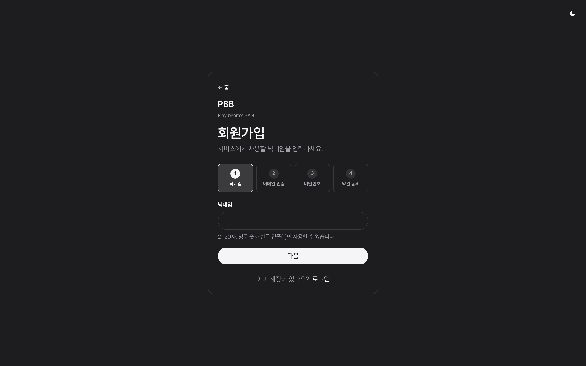

# PBB

Play beom's BAG

공통 JWT 인증 위에 매장 노트(**Veveno**)를 붙인 웹 서비스입니다.  
Java · Spring Boot · React · MySQL로 설계·구현·배포까지 1인이 담당합니다.

막혔던 지점은 「문제 해결 사례」에, 화면에서 DB까지는 「핵심 흐름」에 적었습니다.

[](https://github.com/ohdeg/PBB/actions/workflows/ci.yml)  
**Live:** [app.pbbstudio.com](https://app.pbbstudio.com) · API `api.pbbstudio.com`

| | |
|--|--|
| 인증 | Access는 메모리, Refresh는 HttpOnly 쿠키 + Redis. 401이면 한 번 갱신 후 재요청. 남용은 429 |
| 정합성 | Veveno 재고는 JPA `@Version`. 동시 수정은 덮어쓰지 않고 **409** |
| 검증 | GitHub Actions — JUnit, Testcontainers, Vitest, Playwright |

같은 계정으로 Score Viewer · Sranko도 붙였습니다.

### 미리보기

| 홈 | Veveno |
|:--:|:--:|
|  |  |

로그인·다른 앱 화면은 [아래](#미리보기-나머지)에 있습니다.

## 기술 스택

| 영역 | 기술 |
|------|------|
| Frontend | React, TypeScript, Vite, Zustand, Axios, React Router |
| Backend | Java 25, Spring Boot, Spring Security, JPA, Redis, Actuator |
| ML | FastAPI (분류·rembg·fit-warp), Vertex Gemini (Sranko try-on) |
| Data | MySQL 8, Redis 7, Cloudflare R2 |
| Infra | Docker Compose, Cloudflare Pages / Tunnel / R2 |
| Quality | JUnit 5, Mockito, Testcontainers, Vitest, Playwright, GitHub Actions |

로컬·운영 JDK는 **25**(Gradle toolchain). Sranko 분류·배경제거(FastAPI)와 Gemini try-on은 Spring이 프록시하고, 메인 API는 Spring입니다.

## 인증

- **Access Token** (30분): JSON Body → 프론트 Zustand **메모리**만 보관
- **Refresh Token** (7일): Redis `RT:{email}` + HttpOnly 쿠키 (`Secure` / `SameSite` / 운영 CORS와 함께 점검)
- 앱 기동 시 `POST /auth/refresh`로 세션 복원 · Axios 401 시 갱신 후 원요청 재시도
- 탭 복귀·온라인 복구: `bindAuthResume` (refresh 401만 로그아웃)
- 비밀번호: BCrypt · 회원 ID: UUID (`CHAR(36)`)
- 회원가입 동의: `user_consents` (필수: 이용약관 / 개인정보 / 만 14세 · 선택: 마케팅)
- Rate limit (IP·이메일 각각): 메일 발송·검증·로그인 — 초과 시 HTTP 429

---

## 문제 해결 사례

실제 구현·운영에서 막혔던 지점과 선택지를 정리합니다.  
특히 **Veveno**와 **Sranko**는 도메인·성능·외부 의존성이 겹쳐, 고민 과정과 배운 점을 자세히 적었습니다.

### 1. 인증과 세션 복구

초기에는 로그인 성공 후 토큰을 저장하고 API에 붙이는 방식만 있었습니다. Access Token 만료·새로고침 시 세션이 끊겼고, FE/BE 도메인이 갈라진 운영에서는 로컬에서 되던 쿠키가 빠지기도 했습니다. 탭을 오래 꺼두면 Access는 이미 죽었는데, refresh가 네트워크/5xx로 실패하면 쿠키는 살아 있는데도 로그아웃처럼 보이기도 했습니다.

**해결:** Access Token은 메모리(Zustand)만, Refresh Token은 HttpOnly 쿠키 + Redis. 기동 시 Refresh로 복원, Axios 401이면 refresh 한 번으로 모아서 원요청 재시도. 탭이 다시 보이거나 온라인이 되면 `bindAuthResume`으로 세션을 다시 붙인다. refresh 실패는 **401일 때만** 세션을 버린다. 운영 CORS·`Secure` / `SameSite` / `Path`를 맞춤.

| 고민 | 선택 |
|------|------|
| AT를 localStorage | XSS 위험 → 메모리만, RT로 복원 |
| RT를 JS에서 읽기 | HttpOnly + Redis |
| 동시 401 | refresh 한 번 + 대기열 재시도 |
| 백그라운드에서 AT 만료 | `visibilitychange` / `online`일 때만 refresh |
| refresh 실패 = 무조건 로그아웃 | 401만 `clearAuth`. 5xx·오프라인은 쿠키를 남김 |
| POS 키오스크 401 | 회원 refresh를 돌리지 않고 POS 토큰만 지움 |

**배운 점:** 인증은 JWT 발급으로 끝나지 않고, 브라우저 정책·만료·중복 갱신·“실패의 종류”까지 설계해야 한다.

---

### 2. Veveno — 근무·가입·재고 정합성, 그리고 목록 1+N

소규모 매장 노트에서 UI보다 먼저 막힌 것은 **도메인 규칙**, **동시성**, 그다음 **목록 API의 쿼리 폭발**이었다.

#### 고민한 점

- COVER(대체)와 EXTRA(추가)는 비슷해 보이지만, COVER는 원근무자 필수·EXTRA는 없어야 하고, 신청→지정→수락 흐름이 다르다.
- 자정을 넘는 근무, COVER 취소 시 원근무 복귀를 “삭제”로 처리하면 이력이 사라진다.
- 가입 신청을 MySQL에 영구 저장할지, 승인 전까지만 둘지.
- `leave_date`를 “나간 날”로 두면 당일 근무·대기 일정 정리가 어긋난다.
- 재고 ±는 절대값 PATCH라 두 명이 거의 동시에 바꾸면 Lost Update가 난다.
- 허브·검색·가게 헤더에 「근무중」을 붙이려다, 가게마다 스케줄을 하나씩 조회하면 **1+N**이 된다. 업주를 상시 근무중으로 두면 배지가 거짓 정보가 된다.
- 직원/구독자/공지/커버 목록에서 닉네임을 userId마다 조회하면 같은 1+N이 반복된다.

#### 고민 과정

1. **COVER/EXTRA를 한 API·한 상태로 합치려다** 필수 필드·수락 규칙이 달라, **종류와 상태 머신을 분리**하고 서버에서 규칙 위반을 거절하는 쪽으로 바꿨다. “비슷하니 합치자”는 UX 단순화처럼 보이지만, 서버 검증이 구멍 나기 쉬웠다.

2. **취소 시 row 삭제**를 먼저 시도했다. COVER를 지우면 원근무가 다시 유효해졌는지 이력이 남지 않아, 삭제 대신 **`CANCELLED` 유지**로 바꿨다. “지금 달력에 안 보이면 된 것”과 “감사/분쟁 시 추적”은 다른 요구였다.

3. 시각을 문자열만 비교하면 overnight가 깨져, 종료가 시작보다 이르면 **익일 종료 구간으로 펼쳐** 날짜+시간 겹침을 계산했다. 단위 테스트로 “어제 시작·오늘 새벽 종료”와 “오늘만의 짧은 근무”가 같은 시각대에서 어떻게 겹치는지 고정했다.

4. 가입 pending은 승인 전 영구 저장 가치가 낮다고 보고 **Redis TTL 24h**, 승인 성공 시에만 MySQL 구독·정규 근무로 옮겼다. 만료된 신청은 자연 소멸하고, MySQL은 “실제 멤버십”만 남긴다.

5. `leave_date`는 “서비스 제거일”이 아니라 **마지막 근무일**로 명세·DB·FE를 맞췄다. 당일까지는 근무·권한이 유지되고, `오늘 > leave_date`일 때만 구독·이후 일정·대기 COVER/EXTRA를 정리한다. 날짜 의미 하나를 잘못 잡으면 달력·권한·정리 배치가 전부 어긋났다.

6. 재고는 **비관적 락 vs 낙관적 락**, “마지막 write wins” vs **명시적 409**, 전역 버튼 잠금 vs **해당 stock만 busy**를 비교했다. 짧은 ± 조작에는 `@Version` + 409 + refetch가 단순하고, 충돌을 UI에 드러내는 편이 안전하다고 판단했다.

7. **「근무중」뱃지**는 처음 “업주면 true”로 빠르게 붙였다. 실제로는 업주도 스케줄·자정 넘김·대타 구간이 있어, **열람자 본인이 그 가게의 현재 근무 구간에 있는지**로 바꿨다. 구현을 가게별 루프로 두면 허브에 가게가 N개일 때 스케줄 조회가 N번이라, `storeIds`를 모아 **한 번의 IN 조회 + 메모리에서 현재 시각과 매칭**하는 `onDutyByStoreIds`로 올렸다. 같은 패턴으로 닉네임도 `userId` 집합 → 배치 조회로 맞췄다.

8. **퇴사일을 저장만 하면** 그날 밤 근무가 남아 있는데 권한이 끊긴다. `leave_date`는 마지막 정규일로 두고, 그날 마지막 슬롯이 끝난 뒤에야 구독을 지운다. 허브 조회 때 한 번 확인하고, 놓친 건 `VevenoLeaveFinalizeScheduler`가 서울 매시 정각에 Redis 락 잡고 확정한다.

9. **계산대는 로그인 화면을 두면 안 된다.** 손님 앞에서 이메일/비번을 치면 안 되고, 직원 폰으로 찍는 QR이 맞았다. 페어는 Redis 2분, 세션은 12시간 POS JWT. 처음 등록은 사장님만, 그다음부터는 그 가게 구성원.

10. **호출 번호를 DB에 남기면** 로그·개인정보만 늘고 다시 쓸 일도 없다. 번호는 그때그때 입력하고, 멘트·속도·음높이만 `brew_stores.call_bell_phrase`에 둔다. 말은 브라우저 TTS.

#### 해결 (현재)

- DB에 `shift_kind`(COVER/EXTRA)·신청 주체·원근무자·대타자·상태. 취소는 `CANCELLED`. overnight는 시작/종료 관계로 익일 해석.
- 가입 pending → Redis 24h → 승인 시 MySQL. 퇴사 = 마지막 근무일 기준으로 이후만 정리.
- 재고: `brew_store_stocks.version` + JPA `@Version`. PATCH에 조회 `version`을 실어 보내고 불일치는 **409**. FE는 해당 stock만 busy 후 refetch.
- `StoreResponse.onDuty`: 스케줄 기준(업주 상시 true 아님). 목록/검색/허브는 `onDutyByStoreIds`. 닉네임·구독자 등도 배치 IN.
- FE 허브·검색·가게 헤더에 「근무중」뱃지.
- 정규 근무 교체: **오늘부터** / **지정일부터**(`effective_from` 버전) / **한번만**(그날 override). 지정일 전 주는 이전 시간을 유지.
- 재고 **사용량 일수 안내**(가게 설정, 기본 끔): 감소분을 일별 기록해 「약 N일분」·경고선 임박을 표시.
- 도구 탭(프론트): 단위 변환 · 농도 계산 · 타이머(프리셋만 서버).
- 할 일(체크리스트): 템플릿·오늘 런. 업주가 만들고 직원이 체크.
- 로컬 체험 `/stores/demo`: 로그인 없이 `localStorage`. 사장/직원 토글, 직원 보기에서는 메뉴 편집·발주 URL 숨김.
- UI 한/영/일: 첫 방문은 브라우저 언어, 칩·설정에서 고른 뒤에만 `veveno:lang` 저장. 가게·메뉴·재고 이름은 번역하지 않음. API 오류는 `code`로 프론트가 번역.
- POS: 비로그인 허브 「POS 모드 사용」 → QR → 폰에서 승인 → 계산대 JWT(`type=pos`). 메뉴·오늘 할 일·도구·재고 조회(권한 있으면 수정). 설정·근무 관리·메뉴 쓰기는 API에서 거절.
- 호출벨: `PUT .../call-bell`. 번호는 저장하지 않음. 체험은 `localStorage`.
- 퇴사: 업주만 `resign`. 예약 후 마지막 슬롯 종료 시 확정. 스케줄러 락 `veveno:leave:finalize:lock`.

**고민과 선택**

| 고민 | 선택 |
|------|------|
| COVER/EXTRA 하나로 단순화 | 종류·상태 분리, 서버에서 거절 |
| 취소 시 삭제 | `CANCELLED` 유지 → 원근무 복귀 추적 |
| 자정 넘김을 문자열 비교 | overnight 구간으로 펼쳐 겹침 계산 |
| 가입 pending을 MySQL에 영구 저장 | Redis TTL 24h |
| `leave_date` = 나간 날 | **마지막 근무일**로 통일 |
| 재고 비관적 락 | `@Version` + 409 + stock 단위 busy |
| 업주 = 항상 근무중 | 스케줄 기반 `onDuty` |
| 가게마다 onDuty 쿼리 | `storeIds` 배치 IN + 메모리 판정 |
| 닉네임 userId마다 조회 | ID 모아 배치 조회 |
| 퇴사일 자정에 바로 해제 | 마지막 슬롯 종료 후 + 매시 스케줄러 |
| 계산대에 회원 로그인 | QR 페어 + POS JWT 12h |
| 호출 번호를 이력으로 저장 | 번호는 휘발, 멘트만 DB |

**배운 점**

- **복잡한 if보다 날짜·상태의 의미를 먼저 맞추는 것**이 정합성을 지킨다. `leave_date`, COVER 취소와 원근무 복귀가 대표 예다.
- **비슷해 보이는 도메인이라도 규칙이 다르면 API·상태를 억지로 합치지 않는 편**이 안전하다.
- **동시성은 UI 연타 방지로 끝나지 않는다.** 서버가 “어느 `version` 스냅샷 기준 수정인지”를 검증하고, 충돌을 숨기지 않고 409로 드러내야 한다.
- **배지·표시용 필드도 쿼리 설계 대상이다.** “지금은 근무 중인가”처럼 싸 보이는 플래그가 목록에 붙는 순간 1+N이 된다. **응답에 넣을 값을 유스케이스 단위로 배치 계산**하고, 편의상 업주 예외를 두면 제품 의미가 먼저 망가진다.
- **짧은 충돌·드문 경합**에는 낙관적 락 + 클라이언트 재조회가 단순하고, busy 범위를 stock 단위로 좁히면 다른 품목 조작을 막지 않아도 된다.

---

### 3. 외부 회차 자동 동기화 (DEV 전용 앱)

공개 홈에는 없고, DEV만 들어가는 앱의 회차를 수동·엑셀로만 넣으면 매주 누락되기 쉬웠습니다.

**해결:** 외부 회차 조회 + 토요일 밤 스케줄러. Redis 락으로 중복 실행을 막고, 이미 최신이면 no-op. 자동·수동·엑셀이 같은 저장 경로를 쓰며, 엑셀 빈 칸은 기존 값을 덮지 않게 병합합니다.

**배운 점:** 스케줄은 주기뿐 아니라 중복 실행·외부 실패·멱등성까지 같이 설계한다.

---

### 4. Sranko — 입어보기 품질, 엔진·영속성, 운영 디버깅

DigitalCloset 레거시를 PBB로 옮기면서 **옷장·룩·커뮤니티** UI보다 먼저 막힌 것은 “옷을 합성한다”가 아니라 **치수를 반영한 착용 결과가 믿을 만한가**, 그리고 **운영에서 502/CORS/인증이 한 덩어리로 보이는 문제**였다.

#### 고민한 점

- Vertex `virtual-try-on-001` vs Gemini 이미지: 다벌·풀룩·악세서리 UX와 맞는가.
- 다른 기능의 Gemini API 키와 Vertex ADC(서비스 계정)는 과금·설정이 다르다. 로컬만 되고 운영만 깨지기 쉽다.
- 핏을 UI 배지로만 보여줄지, 착용 이미지 프롬프트에 심을지.
- 둘레 Δ만으로 소매·기장을 판단하면 반팔·반바지가 항상 “매우 타이트”로 나온다.
- 내 사진 try-on은 단벌은 괜찮지만 다벌에서 얼굴·체형이 바뀐다.
- 플랫레이 콜라주와 try-on 룩이 “선택 옷을 보여 주기”에서 역할이 겹친다.
- Look↔Item을 JPA로 묶으면 목록 hydrate에서 1+N이 커진다.
- 브라우저에 `Access-Control-Allow-Origin` 오류가 떠도, 실제로는 Cloudflare **502** HTML에 CORS 헤더가 없어서일 수 있다.
- R2 업로드 TLS `handshake_failure`, Vertex `aiplatform.endpoints.predict` 403처럼 **앱 코드 밖**에서 try-on이 죽는다.

#### 고민 과정

1. **엔진부터 고르면 품질이 따라올 것이라 가정했다.**  
   처음에는 Vertex VTO를 “의류 특화”로 본선에 두었다. 모델 404/400·게이트웨이 502·타임아웃이 반복되고, 다벌·풀룩은 VTO 한 장 제약과 맞지 않아 **풀룩은 Gemini 이미지(필요 시 다단)** 쪽으로 옮겼다. “모델 ID만 바꾸면 된다”는 가설이 깨진 뒤부터는 **입력 계약(치수·슬롯·베이스 이미지)·타임아웃·플래그**를 먼저 고정했다.

2. **핏 미리보기 vs 착용 이미지.**  
   치수 Δ·밴드·2.5D 마네킹 맵으로 타이트/루즈를 먼저 보여 주는 안도 검토했다. 제품 목표는 배지가 아니라 **사진에 물리감이 남는 것**이라 미리보기 전용 UX는 접었다. `fit-check` / analyze로 Δ·`muchTooSmall`를 계산하고 프롬프트에 부위 조건·옷 절대 치수(cm)를 넣었다. 둘레는 raw Δ, 소매·하의 기장은 **카테고리 기대 비율로 재해석**해 반팔·반바지 오판을 줄였고, 전체 try-on primary에서는 소매 길이를 빼 한 부위가 전체를 덮지 않게 했다.

3. **내 사진 유지 vs 마네킹.**  
   여러 벌을 한 장에 입히면 정체성이 무너지는 문제가 반복됐다. “마네킹에 입힌 뒤 얼굴만 합성” 같은 대안도 논의했지만, 1차 범위에서는 **성별 classpath 마네킹을 항상 베이스**로 두고, 신체 치수가 있으면 Δ를, 없어도 아이템 `measurements_json`만이라도 프롬프트에 붙였다. 옷이 많으면 몸통 → 모자/신발 → 나머지로 나누고 몸통 JPEG를 짧게 캐시해, 한 번에 다 넣다 깨지는 문제를 완화했다.

4. **콜라주.**  
   캔버스 비율·슬롯·R2 CORS가 겹쳐 유지비가 컸고, Gemini 풀룩과 역할이 겹쳐 **COMPOSE 콜라주는 제거**하고 TRY_ON 룩으로 통합했다.

5. **룩·커뮤니티 영속성 / 1+N.**  
   Look↔Item JPA 연관은 목록·상세 hydrate 비용이 커질 수 있어 **`item_ids_json`만 저장**하고, 상세/목록은 ID를 모아 **배치 IN**. 커뮤니티 글쓰기용은 `GET /looks/picker`로 **이미지 메타만**(아이템 없음) 내려 조회를 분리했다. 게시 `imageUrls`는 본인 R2 `sranko/{userId}/` 접두만 허용했다.

6. **운영에서 “CORS 오류”로 보이는 502.**  
   브라우저 콘솔은 Origin not allowed + 502를 같이 찍었다. OPTIONS preflight는 백엔드가 살아 있으면 CORS가 정상이었고, **본요청이 Tunnel/업스트림에서 502**이면 HTML에 `Access-Control-Allow-Origin`이 없어 CORS처럼 보였다. try-on은 Vertex 120초·Cloudflare ~100초 제한과도 겹친다. 로그를 따라가며 (1) R2 endpoint를 커스텀 도메인이 아닌 `*.r2.cloudflarestorage.com`으로 고치고 Account ID 자릿수를 맞추고, (2) `GOOGLE_APPLICATION_CREDENTIALS` JSON을 컨테이너에 **마운트**, (3) 서비스 계정에 Vertex AI User·API·결제·프로젝트 ID 일치를 확인하는 순으로 원인을 갈랐다. 권한을 개인 Gmail이 아니라 **`…iam.gserviceaccount.com`**에 줘야 한다는 점도 여기서 재확인했다.

7. **옷장 날씨.**  
   현재 날씨 + 로컬 시각 기준 12시간 예보를 칩(위치·저장 장소·검색)마다 라이브 호출하면 외부 API 지연·쿼터가 바로 커진다. 위도·경도를 그대로 키로 쓰면 GPS 흔들림에 캐시가 빗나간다. **Redis `sranko:forecast:{lat}:{lon}`**, 좌표는 소수 둘째 자리로 반올림, **TTL 30분**. 미스일 때만 예보 API(`days=2`, 자정 넘김)를 치고 JSON을 저장한다. 위치 거부 시에는 `tempC`만으로 합성 응답을 만들고 외부 호출은 하지 않는다.

8. **분류 모델 학습.**  
   시중 가중치를 그대로 쓰면 한국어 옷장 12클래스(긴팔·반팔·민소매·셔츠·후드 / 데님·면바지·반바지·슬랙스 / 외투 / 신발 / 옷아님)와 맞지 않는다. 공개 패션 상품 이미지(대분류·소분류·품목 메타)와 직접 촬영분을 카테고리 폴더로 모아 `ImageFolder`로 읽었다. ImageNet 사전학습 **ResNet18**의 `fc`만 12클래스에 맞추고, 224×224·ImageNet mean/std, CrossEntropy, batch 64, Adam으로 미세조정해 `use.pth`를 저장했다. PBB FastAPI는 그 가중치로 추론만 한다. 택소노미가 달라도 데이터가 부족하면 바로 재학습하지 않고 **매핑 계층**을 두었고, 사용자가 확정한 slot / categoryCode / warmth는 R2 이미지와 함께 **향후 GT**로 남긴다.

#### 해결 (현재)

- FE(JWT) → Spring `/api/v1/sranko/**` → FastAPI(분류·rembg·추출·fit-warp) / Vertex Gemini(try-on). 키·모델은 서버만.
- 상품 사진: 분류 직후 상세로 들어가고, `POST /ml/rembg`가 PNG를 백그라운드로 채움. 착용 사진 추출은 기존 `predict` + `extractWornGarment`.
- try-on: 마네킹 + (body Δ 또는 `fitByItemId`) + 아이템 절대 치수 프롬프트. 결과 R2 `tryon/` + TTL, 「내 룩에 저장」 시 `looks/`로 승격.
- 옷장 다중 선택 → 「룩 입어보기」 → `POST /looks` `source=TRY_ON`.
- 룩 hydrate는 `item_ids_json` + 배치 IN. 커뮤니티는 picker / 본인 R2 URL만.
- 옷장 날씨: Redis `sranko:forecast:` + 좌표 2자리 반올림 + TTL 30분. 히트면 JSON 재사용, 미스면 외부 예보. 위치 거부 시 `tempC` 합성.
- 분류: 레거시에서 학습한 ResNet18 12클래스 `use.pth`를 FastAPI가 서빙. 출력은 `labels.py`가 슬롯·소분류·따뜻함으로 매핑. 사용자 확정값은 재학습 GT.
- prod compose: `fastapi` 서비스 + `SRANKO_ML_BASE_URL=http://fastapi:8000`. Vertex는 `SRANKO_VERTEX_*` + ADC(JSON 마운트).

**고민과 선택**

| 고민 | 선택 |
|------|------|
| Vertex VTO vs Gemini 이미지 | 풀룩·다벌은 Gemini; Spring이 게이트웨이 |
| 다른 Gemini API 키 vs Vertex ADC | 경로·플래그·타임아웃·오류 로그를 분리 |
| 핏 배지 UI vs 착용 이미지 | 미리보기 폐기, Δ·치수를 try-on 조건으로 |
| 둘레 Δ만으로 기장 판단 | 소매·하의는 카테고리 기대 비율로 재해석 |
| 내 사진 고수 vs 마네킹 | 성별 마네킹 베이스 + 다벌 다단·몸통 캐시 |
| 콜라주 보정 vs 제거 | 콜라주 제거, try-on 룩으로 통합 |
| JPA Look↔Item | `item_ids_json` + 배치 IN; picker는 hydrate 생략 |
| 브라우저 CORS로만 디버깅 | 상태코드·업스트림 로그·TLS·IAM을 먼저 확인 |
| R2 공개 URL을 S3 endpoint로 사용 | endpoint는 `r2.cloudflarestorage.com`, 공개 URL은 별도 |
| IAM을 개인 이메일에만 부여 | 키 JSON의 `client_email`(서비스 계정)에 역할 |
| 날씨 칩마다 라이브 API | Redis 30분 TTL, 좌표 반올림 키 |
| GPS 좌표를 캐시 키로 그대로 | 소수 둘째 자리로 묶어 히트 |
| 위치 거부 시에도 예보 호출 | `tempC` 합성, 외부 API 생략 |
| 시중 분류 모델 그대로 | 12클래스에 맞게 ResNet18 미세조정 후 `use.pth` |
| 택소노미가 달라도 바로 재학습 | 매핑 계층 유지, 사용자 확정값을 GT로 적재 |

**배운 점**

- **생성 품질은 모델 ID보다 입력 계약이 먼저다.** 치수 단위·부위 의미(둘레 vs 기장)·슬롯 배타·프롬프트에 넣는 사실의 우선순위가 어긋나면, 모델만 바꿔도 “항상 타이트/항상 일반 옷” 같은 증상이 남는다.
- **한 요청에 욕심낼수록 실패 모드가 곱해진다.** 다벌·악세·정체성 유지를 한 번에 넣기보다, 호출 분할·캐시·“항상 같은 베이스(마네킹)”처럼 **줄일 축을 먼저 정하는 편**이 디버깅과 비용에 유리했다.
- **외부 AI는 도메인 서비스가 아니라 의존성이다.** 인증 방식·쿼터·타임아웃·502를 앱 오류와 구분해 로그·플래그로 다루지 않으면, FE CORS로 오인하거나 로컬만 되는 상태가 길어진다.
- **브라우저 CORS 메시지는 원인을 가릴 수 있다.** 502/504처럼 게이트웨이가 에러 HTML을 주면 Origin 헤더가 없어 CORS로 보인다. **상태 코드와 서버 로그가 1순위**다.
- **인프라 설정은 “환경변수만 넣으면 됨”이 아니다.** R2는 endpoint와 public base URL의 역할이 다르고, Vertex는 파일 마운트·프로젝트 ID·서비스 계정 이메일·API 활성화·결제가 한 세트다. 약정 할인(CUD) 같은 과금 상품은 권한과 무관하다.
- **읽기 경로를 유스케이스별로 쪼개야 1+N을 설계 단계에서 막을 수 있다.** “룩 목록”, “룩 상세 상품”, “글쓰기에 썸네일만”은 같은 엔티티라도 API를 나누는 편이 안전했다.
- **제품에서 겹치는 기능은 보정으로 버티기보다 하나로 합칠 타이밍을 봐야 한다.** 콜라주와 try-on이 같은 문제를 풀고 있을 때, CORS·비율 패치 비용이 엔진 통합보다 커졌다.
- **자주 안 바뀌는 외부 조회는 Redis TTL이 먼저다.** 날씨는 인증 RT·가입 대기와 같이 “짧은 생명” 구간에만 Redis를 썼고, 캐시 키는 GPS 흔들림까지 포함해 설계해야 히트가 난다.
- **학습과 서빙은 같은 클래스 계약이어야 한다.** 폴더 라벨·`fc` 출력 수·서비스 택소노미가 어긋나면 가중치만 바꿔도 옷장이 틀린다. 데이터가 부족하면 재학습보다 매핑을 먼저 두고, 사용자 수정값을 GT로 쌓는 편이 안전했다.

---

### 5. Veveno POS — 계산대에 회원 로그인을 두지 않기

계산대 탭에서 이메일·비밀번호를 치면 손님이 본다. 직원 계정으로 들어가면 설정·근무까지 열려서 더 위험했다.

#### 고민한 점

- 키오스크용 별도 계정을 만들면 비밀번호 관리가 또 생긴다.
- QR을 한 번 찍으면 끝나는지, 폴링이 필요한지.
- 처음 등록하는 기기와, 이미 등록된 기기에 직원이 들어가는 건 권한이 다르다.
- POS JWT가 만료됐을 때 회원 refresh를 타면 계산대가 사장님 세션이 된다.

#### 고민 과정

WhatsApp Web처럼 **화면은 QR, 폰은 이미 로그인한 직원**이 찍는 쪽이 맞았다. 페어는 Redis 2분이면 충분하고, 승인 후 키오스크가 `claim`해서 시크릿을 한 번만 쓴다. 미등록 기기는 사장님만 등록(`POS_OWNER_ENROLL_ONLY`), 등록된 기기는 그 가게 구성원만. JWT `type=pos`는 Veveno 경로에서만 통과하고, 관리 API는 `PosAccess.forbidManagement()`로 막는다. Axios는 키오스크일 때 POS 토큰을 쓰고, 401이면 회원 refresh를 돌리지 않는다.

#### 해결 (현재)

- `POST /pos/sessions` → Redis `veveno:pos:pair:{id}` TTL 2분
- 폰 `POST .../approve` → 상태 APPROVED
- 키오스크 poll → `claim` → POS JWT + `veveno:pos:sess:{deviceId}` TTL 12시간
- 테이블 `brew_pos_devices` (가게당 기기 최대 3)

| 고민 | 선택 |
|------|------|
| 키오스크 전용 계정 | 기존 회원 + QR 페어 |
| 페어를 MySQL에 저장 | Redis TTL 2분, claim 시 삭제 |
| POS 401 → 회원 refresh | POS 토큰만 버리고 키오스크 종료 |
| 아무 가게나 찍기 | 등록된 device는 storeId 고정 |

**배운 점:** 같은 사람·같은 가게라도 **화면의 역할이 다르면 토큰 종류를 나눈다.** 만료 처리도 회원 세션과 섞이면 안 된다.

---

## 핵심 흐름

요청은 화면에서 Spring을 거쳐 MySQL이나 Redis로 내려갑니다. 파일 올리기나 입어보기는 그 뒤에 R2나 FastAPI가 붙습니다.

공통으로, 브라우저는 `frontend/src/api/axios.ts`에서 Authorization을 붙입니다. 계산대면 POS 토큰, 아니면 Zustand에 있는 Access입니다. 서버 `JwtAuthenticationFilter`가 둘을 가립니다. 회원 토큰은 그대로 통과하고, POS JWT는 Veveno URL에서만 받습니다. 이 URL이 공개인지 회원인지는 `SecurityConfig`가 보고, 이 가게 직원인지는 `BrewService.assertCanView` 같은 도메인 검사가 한 번 더 합니다.

API가 401을 주면 회원 요청만 Refresh를 탑니다. 여러 개가 한꺼번에 깨져도 재발급은 한 번입니다. 탭을 다시 열면 `bindAuthResume()`이 세션을 다시 붙입니다. Refresh가 401로 거절된 경우만 로그아웃하고, 서버가 잠시 죽은 동안에는 쿠키를 남겨 둡니다.

### 로그인

로그인 화면에서 `POST /api/v1/auth/login`이 나갑니다. `AuthService.login`이 이메일·IP 한도를 보고 `users`에서 비밀번호를 확인한 다음 Access와 Refresh를 만듭니다. Refresh는 Redis `RT:{email}`에 넣고, HTTP로는 Access만 JSON으로 줍니다. Refresh는 HttpOnly 쿠키입니다.

새로고침하면 `bootstrapAuth()`가 그 쿠키로 `POST /api/v1/auth/refresh`를 보냅니다. 서버가 Redis의 값과 맞는지 보고 토큰을 다시 발급합니다. Access는 메모리에 30분, Refresh는 Redis에 7일 둡니다.

```
LoginPage → POST /api/v1/auth/login → AuthService.login
         → MySQL users, Redis RT:{email}, Cookie refreshToken, body accessToken
```

### Veveno 가입

직원이 가게에 들어가려 하면 `POST /stores/{id}/join`이 Redis `veveno:join:{storeId}:{userId}`에 24시간만 남깁니다. 사장이 그날 안 받으면 키만 사라집니다. 승인되면 그때 `brew_store_subscriptions`에 들어가고 Redis 키는 지웁니다.

### Veveno 재고

재고 ±를 누르면 화면이 들고 있던 `version`을 `PATCH /stocks/{id}`에 같이 보냅니다. `BrewStockService.updateStock`이 DB `version`과 다르면 덮지 않고 409를 줍니다. 그 칸만 다시 불러 고칩니다.

허브 「근무중」은 가게마다 스케줄을 치지 않습니다. 구독 목록이 storeId를 모아 `onDutyByStoreIds` 한 번입니다.

### Veveno POS

계산대에는 이메일 로그인을 두지 않았습니다. 키오스크가 `POST /pos/sessions`로 QR을 띄우면 Redis 페어가 2분 살아 있고, 이미 로그인한 폰이 찍어서 승인합니다. 처음 붙는 기기는 사장만 등록할 수 있습니다. 키오스크가 claim하면 페어는 지워지고, 12시간짜리 POS JWT와 `veveno:pos:sess:{deviceId}`가 남습니다. 그다음부터 계산대 요청은 POS 토큰만 타고, 설정이나 근무 관리 API는 막혀 있습니다.

### Veveno 퇴사

사장이 넣는 퇴사일은 ‘나간 날’이 아니라 마지막 근무일입니다. 그날 근무가 이미 끝났으면 구독과 이후 대타를 바로 정리하고, 아직이면 예약만 합니다. 놓친 건 서울 매시 정각 스케줄러가 Redis 락을 잡고 확정합니다.

### Sranko

옷 사진을 올려도 브라우저는 FastAPI를 직접 부르지 않습니다. `POST /api/v1/sranko/ml/predict`를 Spring이 받아 내부망 FastAPI로 넘깁니다. 분류와 배경 제거가 여기서 됩니다.

여러 벌을 골라 입어보기를 누르면 `POST /api/v1/sranko/ml/try-on`입니다. Spring이 동의·치수·마네킹을 붙인 뒤 Vertex를 호출하고, 결과는 R2에 올립니다. 내 룩으로 저장하면 아이템 id 목록만 `item_ids_json`에 남기고, 나중에 읽을 때 id를 모아 한 번에 가져옵니다.

옷장 날씨는 Redis `sranko:forecast:{lat}:{lon}`을 30분 씁니다. 위경도는 소수 둘째 자리에서 반올림해서, GPS가 살짝 흔들려도 같은 캐시를 칩니다. 없을 때만 예보 API를 부릅니다.

### 그 외

6PICK과 Dieta는 DEV 계정에만 보입니다. 6PICK 회차는 토요일 밤 스케줄러가 락을 잡고 외부 회차를 넣습니다. Dieta 낮 식사는 Redis 큐에 두었다가 마감할 때 Gemini로 넘기고 MySQL 섭취 로그에 씁니다.

Score Viewer는 API가 없습니다. 악보는 이 기기 IndexedDB에 있고, 보기는 `frontend/src/features/score/`입니다.

---

## 현재 앱

| 앱 | 경로 | 설명 |
|----|------|------|
| Veveno | `/hobbies/veveno` | 가게 노트. 허브 `/hub` · 실가게 `/stores/:id`(로그인) · POS `/pos` · 로컬 체험 `/stores/demo` · UI 한/영/일 |
| Sranko | `/hobbies/sranko` | 디지털 옷장 · 상품 사진 rembg · Gemini 입어보기 · 룩 · 커뮤니티 |
| Score Viewer | `/hobbies/score-viewer` | MusicXML/MXL 악보 보관함·연습 뷰어 (OSMD) |

그 외 앱은 DEV 로그인 후에만 홈·탭·URL로 열립니다.

구 경로: `/hobbies/brew-note` → Veveno.

공통: 회원가입(약관) · 로그인 · JWT · 프로필 · 기본 다크 테마 · 회원 탈퇴.

### 미리보기 나머지

| 슈란코 | Score Viewer |
|:--:|:--:|
|  |  |
| **로그인** | **회원가입** |
|  |  |

## 구조

```text
Browser
  ├─ Cloudflare Pages ─ React / Vite (app.*)
  └─ Cloudflare Tunnel ─ Spring Boot (api.*)
                           ├─ MySQL 8
                           ├─ Redis 7
                           ├─ R2 (S3 API)
                           └─ FastAPI (Sranko ML, 내부망만)
```

```text
PBB/
├── frontend/                 # Vite + React
├── spring_backend/           # Spring Boot API
├── fastAPI_backend/          # Sranko ML (predict / rembg / extract / fit-warp)
├── infra/mysql/              # init.sql · migrate_*.sql · migrations/
├── docker-compose.yml        # 로컬 MySQL + Redis
├── docker-compose.prod.yml   # mysql · redis · fastapi · backend · cloudflared
└── docs/                     # 유저 흐름도 (`docs/PBB-유저-흐름도.md`)
```

```text
com.studiobs.spring_backend
├── global/     # config, security, exception, scheduling, R2
└── domain/
    ├── auth/     # 회원가입·로그인·JWT·탈퇴·rate limit
    ├── user/     # User, UserConsent
    ├── config/   # app_config
    ├── brew/     # Veveno (`/api/v1/veveno` · 호환 `/api/v1/brew`)
    ├── sranko/   # 옷장·룩·커뮤니티·ML 프록시·Vertex try-on
    ├── lotto/    # DEV 전용 앱 + 회차 동기화 스케줄러
    ├── dieta/    # DEV 전용 앱
    ├── dev/      # DEV 관리
    └── mail/
```

## 주요 API

| Method | Path | 설명 |
|--------|------|------|
| POST | `/api/v1/auth/email/request` | 회원가입 이메일 코드 발송 |
| POST | `/api/v1/auth/email/verify` | 코드 검증 |
| POST | `/api/v1/auth/signup` | 회원가입 (+ 동의 목록) |
| POST | `/api/v1/auth/login` | 로그인 |
| POST | `/api/v1/auth/refresh` | Access Token 재발급 |
| POST | `/api/v1/auth/logout` | 로그아웃 |
| DELETE | `/api/v1/auth/account` | 회원 탈퇴 |
| — | `/api/v1/veveno/**` (호환: `/api/v1/brew/**`) | Veveno 가게·메뉴·재고·할 일·근무·공지·POS·호출벨 |
| — | `/api/v1/veveno/pos/**` | POS QR 페어·claim·세션 (공개 일부 + 회원 승인) |
| — | `/api/v1/sranko/**` | Sranko prefs·옷장·룩·포스트·업로드·weather·ML |
| — | `/api/v1/lotto/**` | DEV 전용 앱 회차·picks |
| — | `/api/v1/dieta/**` | DEV 전용 앱 |

## 로컬 실행

### 1. 인프라

```bash
docker compose up -d
# 로컬 포트·볼륨만 바꿀 때는 docker-compose.override.yml (git 제외)
```

| 서비스 | 포트 | 참고 |
|--------|------|------|
| MySQL | 3306 | DB `baseball_db` / user `baseball_user` / pw `baseball_password` (레거시 스키마 재사용) |
| Redis | 6379 | 비밀번호 없음 |

신규 컨테이너는 `infra/mysql/init.sql`로 전체 스키마가 생성됩니다.  
이미 떠 있는 볼륨은 `init.sql`이 다시 실행되지 않으므로, 스키마가 뒤처지면 해당 `infra/mysql/migrate_*.sql` 또는 `infra/mysql/migrations/`를 적용하세요. 데이터를 버려도 되면 `docker compose down -v && docker compose up -d`로 맞출 수 있습니다.

### 2. Spring Backend

```bash
cd spring_backend
cp .env.example .env
./gradlew bootRun
```

- 기본 프로필: `dev` (인증 코드는 콘솔 mock 메일)
- API: `http://localhost:8080`
- Sranko ML을 쓰려면 FastAPI를 띄우고 `SRANKO_ML_BASE_URL`을 맞춥니다. try-on 라이브는 `SRANKO_VERTEX_*` + ADC가 필요합니다.

### 3. Frontend

```bash
cd frontend
cp .env.example .env   # VITE_API_BASE_URL=http://localhost:8080
npm install
npm run dev
```

- 앱: `http://localhost:5173`

### 4. FastAPI (Sranko ML)

```bash
cd fastAPI_backend
# Python 3.11–3.12, models/use.pth 배치 후
uvicorn main:app --reload --host 127.0.0.1 --port 8000
```

자세한 설치·환경 변수는 [`fastAPI_backend/README.md`](fastAPI_backend/README.md)를 참고하세요.

## Testing

CI: [workflow](.github/workflows/ci.yml) · [최근 실행](https://github.com/ohdeg/PBB/actions/workflows/ci.yml)  
PR/push 시 frontend lint·build·unit, backend unit·integration을 먼저 실행하고, 성공 시 E2E 스모크를 수행합니다.  
커버리지는 강제 기준 없이 측정해 Actions artifact로 보관합니다.  
대형 취미 앱 페이지는 route-level lazy loading으로 OSMD·xlsx 등이 초기 번들에 포함되지 않게 했습니다.

```bash
# frontend
cd frontend && npm run lint && npm run build && npm test
cd frontend && npm run test:coverage

# backend (Docker 필요 — Testcontainers)
cd spring_backend && ./gradlew test

# e2e 스모크 (로컬)
docker compose up -d
cd spring_backend && SPRING_PROFILES_ACTIVE=dev,e2e ./gradlew bootRun
# 다른 터미널
cd frontend && VITE_API_BASE_URL=http://127.0.0.1:8080 npm run build && npm run preview -- --host 127.0.0.1 --port 4173
cd frontend && PLAYWRIGHT_BASE_URL=http://127.0.0.1:4173 npx playwright install chromium && npm run test:e2e
```

E2E 데모 계정 기본값: `e2e@pbb.test` / `E2ePassw0rd!` (`app.e2e.*` / env `E2E_USER_*`)

```bash
curl https://api.<도메인>/actuator/health
curl https://api.<도메인>/actuator/info
```

외부에는 `health`, `info`만 노출합니다. SMTP health는 기본 비활성화입니다.

## 배포 (Production)

프론트는 **Cloudflare Pages**, 백엔드·MySQL·Redis·FastAPI는 호스트에서 **Docker Compose**, API는 **Cloudflare Tunnel**로 노출합니다.

```text
브라우저 → app.<도메인>  (Cloudflare Pages, frontend/dist)
         → api.<도메인>  (Cloudflare Tunnel → backend:8080)
                           backend → mysql / redis / fastapi / R2
```

```bash
cp .env.prod.example .env.prod
# use.pth → fastAPI_backend/models/use.pth
# Vertex 사용 시 서비스 계정 JSON 마운트 + GOOGLE_APPLICATION_CREDENTIALS
docker compose -f docker-compose.prod.yml --env-file .env.prod up -d --build
```

| 항목 | 값 |
|------|-----|
| Pages Root | `frontend` |
| Build | `npm run build` |
| Output | `dist` |
| 환경변수 | `VITE_API_BASE_URL=https://api.<도메인>` |

SPA 라우팅: `frontend/public/_redirects` (`/* /index.html 200`)

운영 시크릿(`.env` / `.env.prod`, `secrets/`, `*.pem`, 모델 가중치)과 로컬 오버라이드(`docker-compose.override.yml`)는 git에 올리지 않습니다. 예시는 `.env.prod.example`, `spring_backend/.env.example`을 참고하세요.
