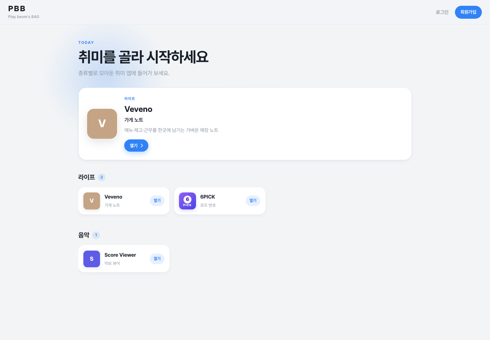

# PBB — Play beom's BAG

[](https://github.com/ohdeg/PBB/actions/workflows/ci.yml)

취미 앱을 모아 둔 **PBB** 플랫폼입니다.  
메인 브랜드는 **PBB (Play beom's BAG)** 이며, 홈에서 카테고리별 취미 앱으로 진입합니다.

## Portfolio

- **Live:** [app.pbbstudio.com](https://app.pbbstudio.com)
- **형태:** 개인 프로젝트 — 기획, UX 흐름, React/Spring 구현, 테스트, 인프라와 배포 전 과정 담당
- **문제:** 서로 다른 취미 도구를 매번 별도 앱으로 관리하지 않고, 공통 인증과 일관된 진입 경험 위에서 사용할 수 있게 구성
- **해결:** 하나의 PBB 셸 안에 Veveno·6PICK·Dieta·Score Viewer를 도메인별로 분리하고, 공통 계정·권한·운영 인프라를 공유
- **검증:** JUnit/Mockito, MySQL·Redis Testcontainers, Vitest coverage, Playwright를 GitHub Actions PR 게이트로 연결
- **운영:** Spring Security 공개/회원/DEV 이중 인가, Actuator health/info, JaCoCo·Vitest coverage artifact

대표 사례인 **Veveno**는 소규모 매장의 메뉴·레시피·재고(낙관적 락)·직원 근무·대타/추가 근무를
한곳에서 관리합니다. 6PICK은 외부 회차 데이터 동기화와 Redis 분산 락을,
Dieta는 체중·섭취·활동 주간 코칭을, Score Viewer는 브라우저 기반 MusicXML 렌더링·연습 기능을 보여 줍니다.



```text
Browser
  ├─ Cloudflare Pages ─ React / Vite
  └─ Cloudflare Tunnel ─ Spring Boot
                           ├─ MySQL 8
                           ├─ Redis 7
                           └─ R2 (S3 API)
```

## 현재 앱

| 앱 | 경로 | 설명 |
|----|------|------|
| Veveno | `/hobbies/veveno` | 가게 노트. 랜딩 공개 · 허브 `/hub` · 가게 `/stores/:id` (로그인 필수) |
| 6PICK | `/hobbies/6pick` | 로또 번호 생성·세금 계산·회차 관리 (당첨번호 자동 동기화) |
| Dieta | `/hobbies/dieta` | 체중·섭취·활동량 주간 코칭 |
| Score Viewer | `/hobbies/score-viewer` | MusicXML/MXL 악보 보관함·연습 뷰어 (OSMD) |

하위 호환 리다이렉트: `/hobbies/lotto` → 6PICK · `/hobbies/brew-note` → Veveno · `/hobbies/ipbt`·`analyze-baseball`·`pbb`·`/analysis` → 홈

공통 기능: 회원가입(약관 동의) · 로그인 · JWT · 프로필 · 회원 등급(FREE/DEV) · 회원 탈퇴 · 점검/오류/404 화면

## 기술 스택

| 영역 | 기술 |
|------|------|
| Frontend | Vite, React, TypeScript, Zustand, Axios, React Router, OpenSheetMusicDisplay, JSZip |
| Main Backend | Java 25, Spring Boot, Spring Security, Actuator, JPA, Redis, Mail, Scheduling, R2(S3 API) |
| Analytics Backend | Python, FastAPI (스캐폴드) |
| Infra | MySQL 8, Redis 7, Docker Compose |
| Quality | JUnit 5, Mockito, Testcontainers, Vitest, Playwright, GitHub Actions, JaCoCo |

## 구조

```text
PBB/
├── frontend/                 # Vite + React
├── spring_backend/           # Spring Boot API
├── fastAPI_backend/          # FastAPI (스캐폴드)
├── infra/mysql/init.sql      # 현재 최종 스키마 (신규 DB 단일 출처)
├── docker-compose.yml        # 로컬 MySQL + Redis
├── docker-compose.prod.yml   # 운영 backend + MySQL + Redis + Tunnel
└── docs/                     # 유저 흐름도 등
```

```text
com.studiobs.spring_backend
├── global/     # config, security, exception, scheduling, R2
└── domain/
    ├── auth/     # 회원가입·로그인·JWT·탈퇴·rate limit
    ├── user/     # User, UserConsent
    ├── config/   # app_config (추천 앱)
    ├── brew/     # Veveno (공개 API `/api/v1/veveno` · 하위 호환 `/api/v1/brew`)
    ├── lotto/    # 6PICK + 동행복권 동기화 스케줄러
    ├── dieta/    # Dieta 프로필·체크인·섭취·레시피
    ├── dev/      # DEV 관리 (회원 등급·추천 앱·R2)
    └── mail/
```

## 인증

- **Access Token** (30분): JSON Body → 프론트 Zustand **메모리**만 보관
- **Refresh Token** (7일): Redis `RT:{email}` + HttpOnly 쿠키 (`Secure` / `SameSite` / 운영 CORS와 함께 점검)
- 앱 기동 시 `POST /auth/refresh`로 세션 복원 · Axios 401 시 갱신 후 원요청 재시도
- 비밀번호: BCrypt · 회원 ID: UUID (`CHAR(36)`)
- 회원가입 동의: `user_consents` (필수: 이용약관 / 개인정보 / 만 14세 · 선택: 마케팅)
- Rate limit (IP·이메일 각각): 메일 발송·검증·로그인 — 초과 시 HTTP 429

## 주요 API

| Method | Path | 설명 |
|--------|------|------|
| POST | `/api/v1/auth/email/request` | 회원가입 이메일 코드 발송 |
| POST | `/api/v1/auth/email/verify` | 코드 검증 |
| POST | `/api/v1/auth/signup` | 회원가입 (+ 동의 목록) |
| POST | `/api/v1/auth/login` | 로그인 |
| POST | `/api/v1/auth/refresh` | Access Token 재발급 |
| POST | `/api/v1/auth/logout` | 로그아웃 |
| DELETE | `/api/v1/auth/account` | 회원 탈퇴 |
| GET | `/api/v1/config/featured-app` | 홈 추천 앱 목록 (공개) |
| PUT | `/api/v1/dev/featured-app` | 추천 앱 설정 (DEV) |
| — | `/api/v1/veveno/**` (호환: `/api/v1/brew/**`) | Veveno 가게·메뉴·재고·근무·공지 등 |
| — | `/api/v1/lotto/**` | 6PICK 회차·picks (DEV 회차 관리 포함) |
| — | `/api/v1/dieta/**` | Dieta 온보딩·체크인·섭취·레시피 |

## 문제 해결 사례

포트폴리오용으로, 실제 운영·도메인에서 막혔던 지점과 선택지를 정리합니다.

### 1. 인증과 세션 복구 구조 개선

초기에는 로그인 성공 후 토큰을 저장하고 API 요청에 첨부하는 방식만 구현했습니다. Access Token이 만료되거나 페이지를 새로고침하면 로그인 상태가 사라졌고, 운영에서 FE/BE 도메인이 분리되면 로컬에서 되던 쿠키가 전달되지 않는 경우도 있었습니다.

**해결:** Access Token은 메모리(Zustand)만, Refresh Token은 JS가 읽을 수 없는 HttpOnly 쿠키로 전달했습니다. 앱 시작 시 Refresh API로 세션을 복원하고, Axios 인터셉터에서 401이면 갱신 후 원요청을 재실행합니다. 갱신 실패 시 인증 상태를 비우고 로그인으로 보냅니다. 운영 CORS와 쿠키 `Secure` / `SameSite` / `Path`도 함께 맞췄습니다.

**고민과 선택**

| 고민 | 선택 |
|------|------|
| AT를 localStorage에 두면 XSS에 노출 | 메모리만 보관 → 새로고침 시 RT로 복원 |
| RT를 JS에서 다루면 탈취 위험 | HttpOnly 쿠키 + Redis `RT:{email}` |
| 여러 요청이 동시에 401 | 인터셉터에서 refresh 단일화 후 대기열 재시도 |
| 로컬은 되고 운영만 쿠키 누락 | 크로스 도메인 CORS·SameSite·Secure 점검 |

**배운 점:** 인증은 JWT 발급으로 끝나지 않고, 브라우저 정책·만료·중복 갱신까지 설계해야 한다.

### 2. Veveno 근무 상태·날짜 처리와 가입·퇴사 정합성

정규 근무 외에 대체(COVER)·추가(EXTRA)가 필요했습니다. 비슷해 보여 한 구조로 묶으려 했지만, COVER는 원래 근무자가 필수이고 EXTRA는 없어야 하며, 신청 직후 대체자가 비어 있거나 지정 후 수락이 필요한 등 규칙이 달랐습니다. 자정 넘김 근무·승인 취소 시 원근무 복귀도 필요했습니다.

직원 가입 신청은 승인 전 영구 저장이 불필요하다고 보고 Redis에 24h만 두고, 승인 시에만 MySQL 구독·정규 근무로 옮겼습니다. 퇴사일은 “서비스 제거일”이 아니라 **마지막 근무일**로 정의해 당일까지 유지하고, 이후 일정·대기 COVER/EXTRA만 정리했습니다.

**해결:** `shift_kind`(COVER/EXTRA)·신청 주체·원근무자·대타자·상태를 DB에 명시하고, 취소는 삭제 대신 `CANCELLED`로 이력을 남깁니다. overnight는 종료 시각이 시작보다 이르면 익일 종료로 해석해 겹침을 날짜+시간으로 비교합니다.

**고민과 선택**

| 고민 | 선택 |
|------|------|
| COVER/EXTRA를 한 API·한 상태로 단순화 | 종류·상태 머신을 분리해 규칙 위반을 서버에서 거절 |
| 취소 시 row 삭제 | `CANCELLED` 유지 → COVER 취소 시 원근무 다시 유효 |
| 자정 넘김을 문자열 시각만 비교 | overnight 구간으로 펼쳐 겹침 계산 |
| 가입 pending을 MySQL에 영구 저장 | Redis TTL 24h → 승인 성공 시에만 MySQL |
| `leave_date`를 “나간 날”로 해석 | “마지막 근무일”로 명세·DB·FE 기준 통일 |

**배운 점:** 복잡한 if보다 도메인 상태·날짜 의미를 먼저 맞추는 것이 정합성을 지킨다.

### 3. 6PICK 당첨 번호 자동 동기화

회차를 DEV가 수동·엑셀로만 넣으면 매주 누락되기 쉬웠습니다.

**해결:** 동행복권 조회 클라이언트 + 토요일 밤 10분 간격 스케줄러로 `lotto_draws`에 반영합니다. Redis `lotto:sync:lock`(TTL 5분)으로 다중 인스턴스·중복 실행을 막고, 이미 최신 회차면 no-op입니다. 자동·수동·엑셀이 같은 서비스 저장 경로를 쓰며, 엑셀 빈 칸은 기존 값을 덮지 않게 병합합니다.

**고민과 선택**

| 고민 | 선택 |
|------|------|
| 스케줄만 돌리면 인스턴스마다 중복 INSERT | Redis 분산 락 + 멱등(이미 있으면 skip) |
| 자동/수동 저장 로직 분기 | 단일 서비스 계층으로 합침 |
| 엑셀 부분 누락 | null/빈 값은 기존 row와 병합 |

**배운 점:** 스케줄은 주기뿐 아니라 중복 실행·외부 실패·멱등성까지 같이 설계한다.

### 4. Veveno 재고 동시 수정과 낙관적 락

재고 ±는 절대값 PATCH라, 두 명이 거의 동시에 같은 품목을 바꾸면 나중에 온 요청이 이전 변경을 덮는 Lost Update가 가능했습니다. 성공 응답만 보면 한쪽 수정이 조용히 사라질 수 있습니다. 혼자 연타해도 응답 전 같은 `version`을 여러 번내면 409가 납니다.

**해결:** `brew_store_stocks.version` + JPA `@Version`. 조회 응답의 `version`을 PATCH에 실어 보내고, 불일치·optimistic lock 예외는 **409**와 안내 메시지로 매핑합니다. FE는 409 시 목록 refetch, 요청 중에는 **해당 재고의 ±만** 비활성화해 연타를 막습니다. IT·Vitest와 Notion DB 스키마에 반영했습니다. (`infra/mysql/migrate_brew_stock_version.sql`)

**고민과 선택**

| 고민 | 선택 |
|------|------|
| DB 비관적 락 vs 낙관적 락 | 짧은 재고 ±에 `@Version` + 409가 단순하고 충돌을 드러냄 |
| 충돌을 마지막 write wins로 두기 | 명시적 실패 + 클라이언트 재조회 |
| 전역 버튼 잠금 | 수정 중인 stockId만 busy (다른 품목은 조작 가능) |
| 고정 ms 대기 | 응답으로 최신 `version`이 state에 반영된 뒤 해제 |

**배운 점:** 동시성은 UI 연타 방지뿐 아니라, 서버가 “어느 스냅샷 기준 수정인지”를 검증해야 한다.

## 로컬 실행

### 1. 인프라

```bash
docker compose up -d
```

| 서비스 | 포트 | 참고 |
|--------|------|------|
| MySQL | 3306 | DB `baseball_db` / user `baseball_user` / pw `baseball_password` |
| Redis | 6379 | 비밀번호 없음 |

신규 컨테이너는 `infra/mysql/init.sql`로 전체 스키마가 생성됩니다.

이미 떠 있는 MySQL 볼륨은 `init.sql`이 다시 실행되지 않습니다. 스키마가 코드보다 오래되면 Spring이 `ddl-auto: validate`에서 기동 실패합니다. 기존 데이터를 유지하려면 필요한 마이그레이션을 적용하세요:

```bash
# 예: Dieta 테이블
docker exec -i baseball-mysql mysql -uroot -proot_password baseball_db < infra/mysql/migrate_dieta.sql
# 예: Veveno 재고 version (낙관적 락)
docker exec -i baseball-mysql mysql -uroot -proot_password baseball_db < infra/mysql/migrate_brew_stock_version.sql
```

로컬 데이터를 버려도 되면 `docker compose down -v && docker compose up -d`로 볼륨을 재생성하면 `init.sql` 기준으로 맞춰집니다.

### 2. Spring Backend

```bash
cd spring_backend
cp .env.example .env
./gradlew bootRun
```

- 기본 프로필: `dev` (인증 코드는 콘솔 mock 메일)
- API: `http://localhost:8080`

### 3. Frontend

```bash
cd frontend
cp .env.example .env   # VITE_API_BASE_URL=http://localhost:8080
npm install
npm run dev
```

- 앱: `http://localhost:5173`

## Testing

CI: [workflow](.github/workflows/ci.yml) · [최근 실행](https://github.com/ohdeg/PBB/actions/workflows/ci.yml)
PR/push 시 frontend lint·build·unit, backend unit·integration을 먼저 실행하고, 모두 성공하면 E2E 스모크를 수행합니다.
커버리지는 강제 기준 없이 측정하여 frontend/backend HTML 리포트를 Actions artifact로 보관합니다.
대형 취미 앱 페이지는 route-level lazy loading으로 분리해 Score Viewer의 OSMD·JSZip과 6PICK의 xlsx가 초기 번들에 포함되지 않게 했습니다.

```bash
# frontend unit
cd frontend && npm run lint && npm run build && npm test
cd frontend && npm run test:coverage

# backend unit + Testcontainers IT (Docker 필요)
cd spring_backend && ./gradlew test
# HTML: spring_backend/build/reports/jacoco/test/html/index.html

# e2e 스모크 (로컬)
docker compose up -d
cd spring_backend && SPRING_PROFILES_ACTIVE=dev,e2e ./gradlew bootRun
# 다른 터미널
cd frontend && VITE_API_BASE_URL=http://127.0.0.1:8080 npm run build && npm run preview -- --host 127.0.0.1 --port 4173
cd frontend && PLAYWRIGHT_BASE_URL=http://127.0.0.1:4173 npx playwright install chromium && npm run test:e2e
```

E2E 데모 계정 기본값: `e2e@pbb.test` / `E2ePassw0rd!` (`app.e2e.*` / env `E2E_USER_*`)

운영 상태 확인:

```bash
curl https://api.<도메인>/actuator/health
curl https://api.<도메인>/actuator/info
```

외부에는 `health`, `info`만 노출하며 health 상세 정보는 숨깁니다. SMTP health는 기본 비활성화하고
운영에서 필요할 때 `MANAGEMENT_HEALTH_MAIL_ENABLED=true`로 켤 수 있습니다.

### 4. FastAPI (스캐폴드)

```bash
cd fastAPI_backend
uvicorn main:app --reload
```

## 배포 (Production)

프론트는 **Cloudflare Pages**, 백엔드·MySQL·Redis는 자체 호스트에서 **Docker Compose**로 운영하고,
백엔드는 **Cloudflare Tunnel**로 노출합니다.

```text
브라우저 → app.<도메인>  (Cloudflare Pages, frontend/dist)
         → api.<도메인>  (Cloudflare Tunnel → backend:8080)
                           backend → mysql / redis  (외부 비공개)
```

### 1. 백엔드 + DB + Redis

```bash
cp .env.prod.example .env.prod
docker compose -f docker-compose.prod.yml --env-file .env.prod up -d --build
```

### 2. Cloudflare Tunnel

Zero Trust → Tunnels: Public hostname `api.<도메인>` → `http://backend:8080`  
토큰을 `.env.prod`의 `CLOUDFLARE_TUNNEL_TOKEN`에 설정

### 3. Cloudflare Pages

| 항목 | 값 |
|------|-----|
| Root directory | `frontend` |
| Build command | `npm run build` |
| Output directory | `dist` |
| 환경변수 | `VITE_API_BASE_URL=https://api.<도메인>` |

SPA 라우팅용 `frontend/public/_redirects` 포함 (`/* /index.html 200`)
