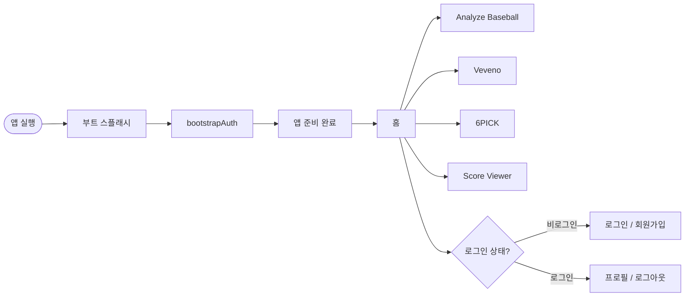
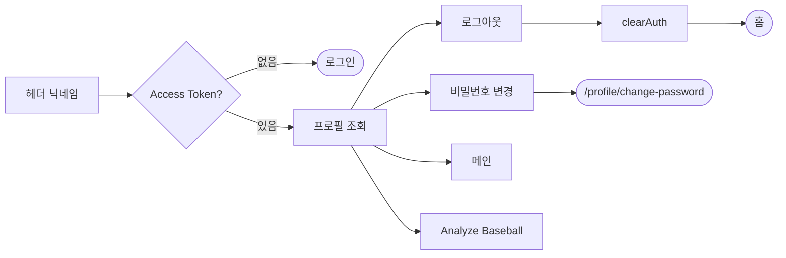
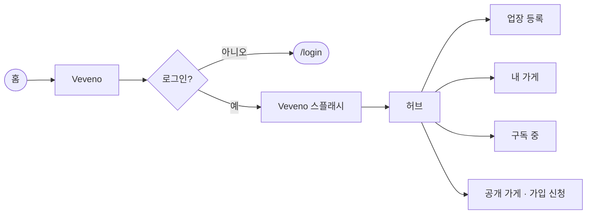
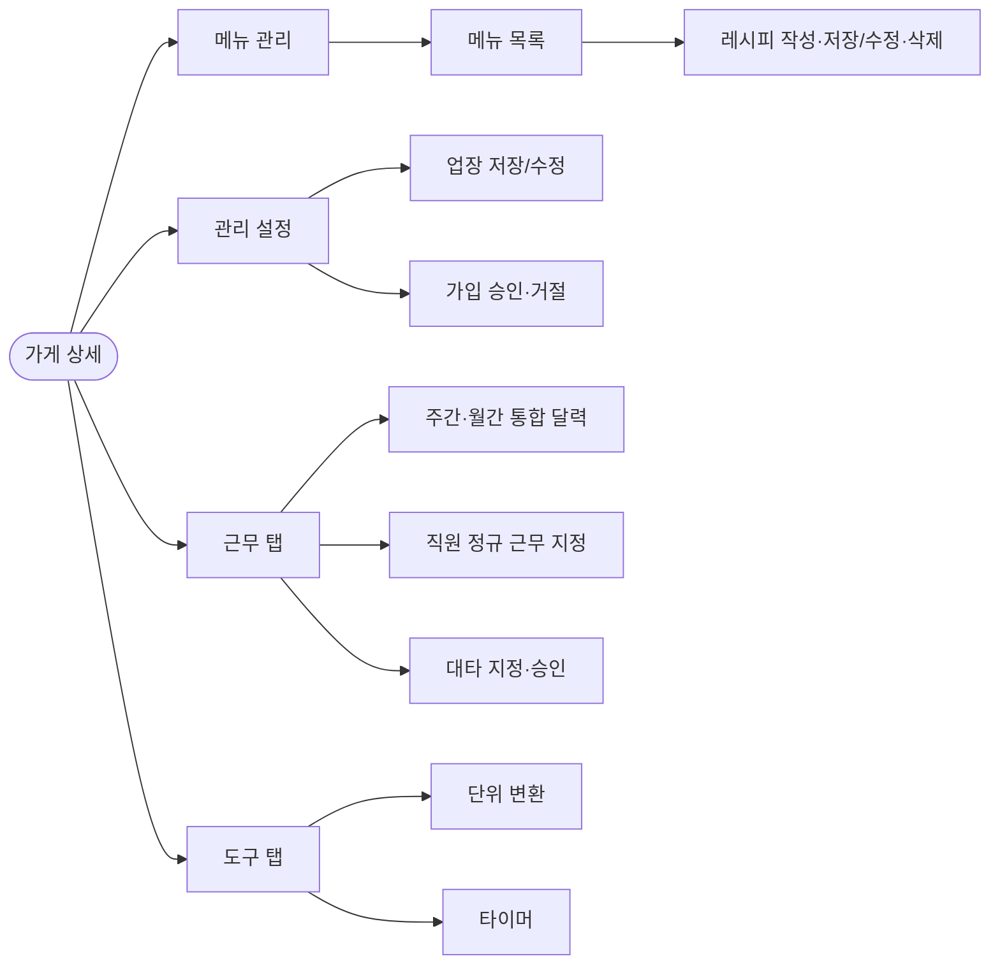
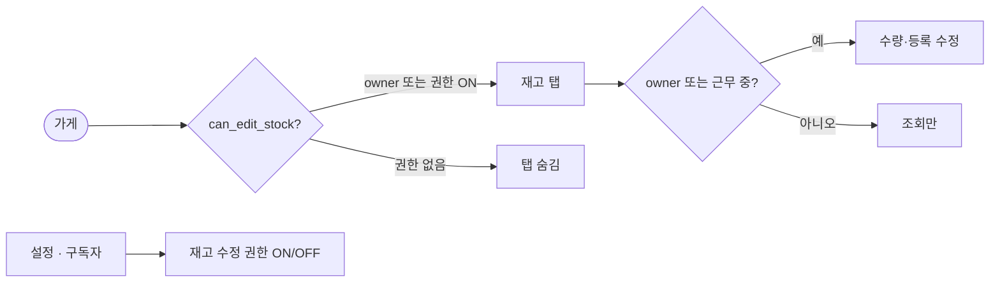
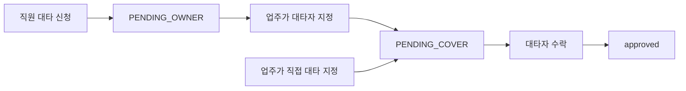
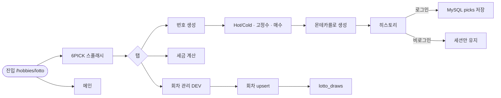
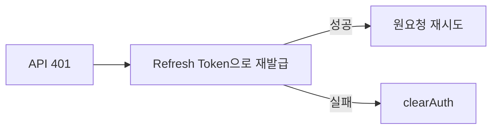

# PBB 기능별 유저 흐름도

기준: 현재 프론트엔드 라우트·화면 구현 (`frontend/src`)  
FigJam: [PBB 유저 흐름도](https://www.figma.com/board/7VmuTicHtscXPF1VJ91B9J/PBB-%EC%9C%A0%EC%A0%80-%ED%9D%90%EB%A6%84%EB%8F%84)

> FigJam은 Design처럼 페이지가 없어 **기능별 섹션**으로 분리해 두었습니다.  
> 좌측 레이어/섹션 목록에서 `0.~7.` 섹션을 클릭하면 해당 흐름으로 이동합니다.

> 취미 앱(Analyze Baseball / 6PICK / Score Viewer)은 **비로그인 진입 가능**.  
> Veveno·**프로필**은 Access Token 필요 (없으면 `/login` 리다이렉트).

---

## 0. 앱 부트 · 전체 맵



---

## 1. 회원가입 `/signup`


단계: 닉네임 → 이메일 인증 → 비밀번호 → 약관 동의 → 완료 후 `/login`

---

## 2. 로그인 `/login`


---

## 3. 이메일 찾기 `/find-email`


---

## 4. 비밀번호 재설정 `/reset-password`


단계: 이메일 → 코드 검증 → 새 비밀번호 → `/login`

---

## 4-1. 비밀번호 변경 (로그인) `/profile/change-password`

FigJam **3-1. 비밀번호 변경** — 로그인된 사용자 전용. 비로그인 `/reset-password`와 별개.


단계: 프로필 → 이메일 인증 → 새 비밀번호 → 서버 동일 비번 거부 → 변경 후 `clearAuth` → `/login`

---

## 5. 프로필 · 로그아웃 `/profile`



헤더에서도 로그아웃 가능 (로그아웃 후 현재 페이지 유지).

---

## 6. 홈 → 취미 앱 진입

```mermaid
flowchart LR
    home([홈]) --> featured[추천 Analyze Baseball]
    home --> sports[스포츠]
    home --> life[라이프]
    home --> music[음악]
    featured --> baseball[/hobbies/analyze-baseball]
    sports --> baseball
    life --> brew[/hobbies/brew-note]
    life --> lotto[/hobbies/lotto]
    music --> score[/hobbies/score-viewer]
```

---

## 7. Analyze Baseball


현재 UI 스캐폴드 단계.

---

## 8. Veveno (구 Brew Note)

FigJam §8~8-3 + Notion DB 스키마 기준.  
결제(PG/카드) §8-4·8-5는 스키마 미정의로 **미구현**.

### 8-0. 진입 (로그인 필수)

진입 시 **Veveno 스플래시**(앱 외부에서 진입할 때)를 표시한 뒤 허브/가게 상세로 전환.



### 8-1. 도메인

`brew_stores` → `brew_menus` → `brew_recipes`  
`brew_store_stock_categories` → `brew_store_stocks`  
`brew_store_subscriptions` + Redis `brew:join:{storeId}:{userId}` (TTL 24h)  
`brew_staff_schedules` (요일 반복 정규 근무, 자정 넘김: `end < start`)  
`brew_shift_covers` (날짜 단위 대타)

### 8-2. Owner — 메뉴 · 설정



### 8-2b. 도구 (owner·구독자)

프론트 전용 (서버 저장 없음). 탭 이동 중에도 타이머는 모듈 상태로 유지.

- **단위 변환**: 무게(g/kg/oz/lb), 부피(ml/L/cup/fl oz/tbsp/tsp), 온도(°C↔°F), 배율
- **타이머**: 단계 1개면 일반, 2개 이상이면 끝나면 다음 자동 시작. 타이머 여러 개 동시 실행 가능
- 전체 종료 시 비프 패턴 최대 10회 반복. 카드의 **완료**를 누르면 즉시 알람 중단
- **프리셋**: 계정(PERSONAL) / 가게 공용(STORE). owner·구독자 모두 가게 프리셋 CRUD 가능 (`brew_timer_presets`)

### 8-3. 재고 (수정 권한자만)



- `brew_store_subscriptions.can_edit_stock = 1` 또는 owner만 재고 탭 표시
- **수정**은 owner이거나 (권한 ON **그리고** 현재 근무 중 — 본인 정규 또는 승인 대타). 자정 넘김 근무 포함
- Owner는 설정 → 구독자 · 재고 권한에서 부여
- 카테고리: **편집** 모드에서만 추가·이름 수정·삭제 (레시피 목록과 동일 패턴)

### 8-3b. 근무 · 대타



- 업주: 매장 직원 **전원** 스케줄을 하나의 주간/월간 달력에서 조회
- 직원: 본인 정규 + 관련 대타만 조회
- 직원 신청에서는 대타자를 선택하지 않음. 신청 후 업주가 대타자를 지정
- 대타 승인: 직원 신청 → 업주 대타자 지정 → 지정된 대타자 수락
- 대타자 지정 제한: 해당 구간에 **정규 근무** 또는 **승인된 다른 대타**가 겹치는 직원은 지정 불가 (자정 넘김 근무 포함, 서버 409 + 프런트 드롭다운에서 제외)

라우트:
- `/hobbies/brew-note` — 허브 (로그인 필수)
- `/hobbies/brew-note/stores/:storeId` — 메뉴 / 재고 / 근무 / 도구 / 설정
- 메뉴 탭 **카테고리(메뉴) 목록**: 일반 클릭은 선택(레시피 조회), **편집** 모드에서 클릭 시 이름 수정·삭제 모달

---

## 9. 6PICK

Firebase 로또 앱(6PICK)을 MySQL로 이식. PBB 기존 로그인 유지(Google OAuth 없음).  
진입 시 **6PICK 스플래시**(로고)를 표시한 뒤 본 화면으로 전환.  
당첨 번호 **자동 조회(동행복권 동기화)는 미구현** — DEV가 회차 수동 등록.



- 공개: 회차 목록 조회, 번호 생성·세금 계산
- 로그인: 생성 히스토리 `lotto_user_picks` 저장
- DEV(`userClass=dev`): 회차 수동 등록·수정, **엑셀(.xlsx) 일괄 가져오기**(기존 회차 전체 대체)

---

## 10. Score Viewer


보관함에서 악보를 선택한 뒤 연습 뷰어로 진입한다. 광고·클라우드 구독은 이식하지 않음(로컬 IndexedDB만).

---

## 11. 세션 유지 (백그라운드)



---

## 라우트 요약

| 경로 | 기능 | 인증 |
|------|------|------|
| `/` | 홈 · 취미 앱 스토어 | 선택 |
| `/signup` | 회원가입 | 불필요 |
| `/login` | 로그인 | 불필요 |
| `/find-email` | 이메일 찾기 | 불필요 |
| `/reset-password` | 비밀번호 재설정 | 불필요 |
| `/profile` | 프로필 · 로그아웃 | **필수** |
| `/profile/change-password` | 비밀번호 변경 (로그인) | **필수** |
| `/hobbies/analyze-baseball` | 야구 분석 | 선택 |
| `/hobbies/brew-note` | Veveno 허브 | **필수** |
| `/hobbies/brew-note/stores/:storeId` | 가게(메뉴·재고·근무·도구·설정) | **필수** |
| `/hobbies/lotto` | 6PICK (로또 번호·세금·회차 DEV) | 선택(히스토리 저장은 로그인) |
| `/hobbies/score-viewer` | 악보 보관함 | 선택 |
| `/hobbies/score-viewer/:id` | 악보 연습 뷰어 | 선택 |
