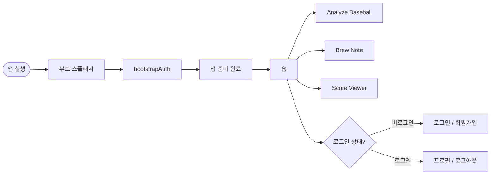
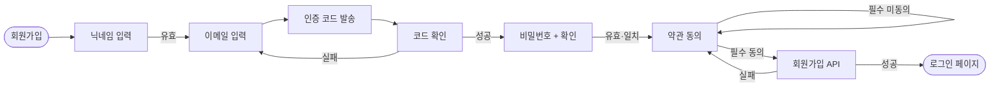
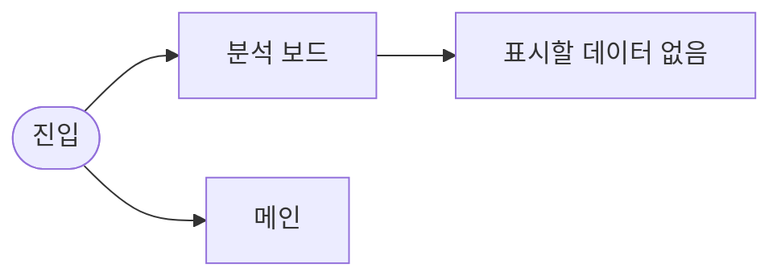
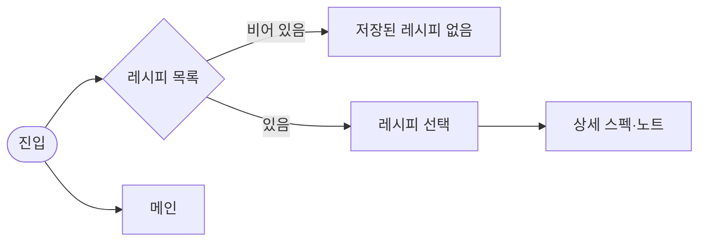
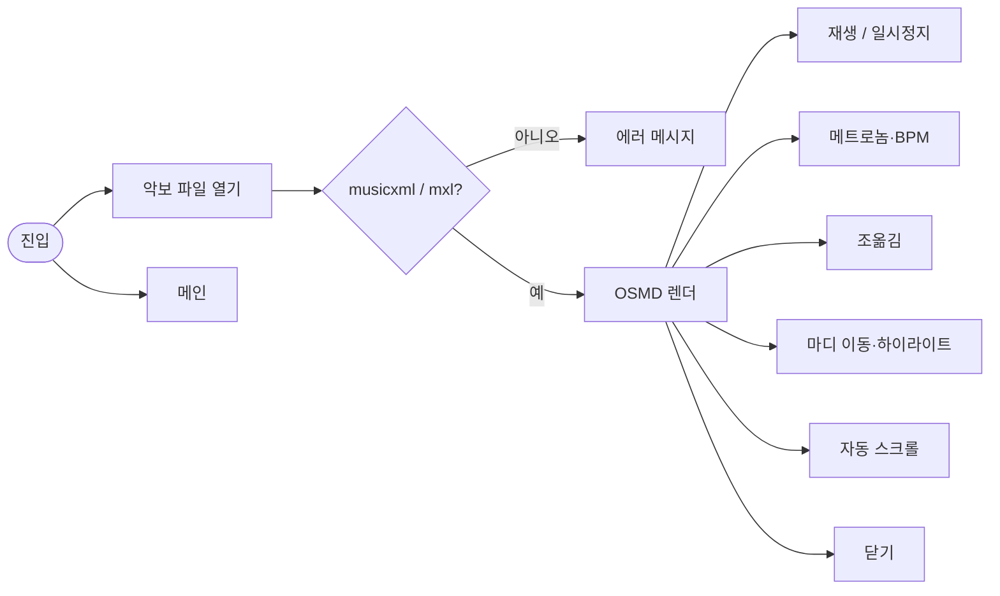
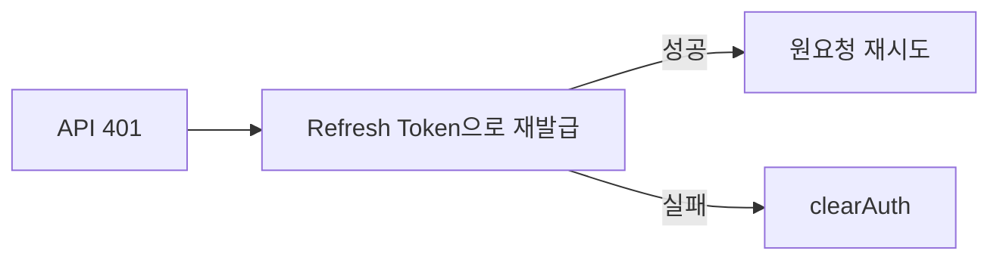

# PBB 기능별 유저 흐름도

기준: 현재 프론트엔드 라우트·화면 구현 (`frontend/src`)  
FigJam: [PBB 유저 흐름도](https://www.figma.com/board/7VmuTicHtscXPF1VJ91B9J/PBB-%EC%9C%A0%EC%A0%80-%ED%9D%90%EB%A6%84%EB%8F%84)

> FigJam은 Design처럼 페이지가 없어 **기능별 섹션**으로 분리해 두었습니다.  
> 좌측 레이어/섹션 목록에서 `0.~7.` 섹션을 클릭하면 해당 흐름으로 이동합니다.

> 취미 앱(Analyze Baseball / Brew Note / Score Viewer)은 **비로그인 진입 가능**.  
> **프로필**만 Access Token 필요 (없으면 `/login` 리다이렉트).

---

## 0. 앱 부트 · 전체 맵



---

## 1. 회원가입 `/signup`



단계: 닉네임 → 이메일 인증 → 비밀번호 → 약관 동의 → 완료 후 `/login`

---

## 2. 로그인 `/login`


---

## 3. 이메일 찾기 `/find-email`


---

## 4. 비밀번호 재설정 `/reset-password`


단계: 이메일 → 코드 검증 → 새 비밀번호 → `/login`

---

## 4-1. 비밀번호 변경 (로그인) `/profile/change-password`

FigJam **3-1. 비밀번호 변경** — 로그인된 사용자 전용. 비로그인 `/reset-password`와 별개.


단계: 프로필 → 이메일 인증 → 새 비밀번호 → 서버 동일 비번 거부 → 변경 후 `clearAuth` → `/login`

---

## 5. 프로필 · 로그아웃 `/profile`


헤더에서도 로그아웃 가능 (로그아웃 후 현재 페이지 유지).

---

## 6. 홈 → 취미 앱 진입

```mermaid
flowchart LR
    home([홈]) --> featured[추천 Analyze Baseball]
    home --> sports[스포츠]
    home --> life[라이프]
    home --> music[음악]
    featured --> baseball[/hobbies/analyze-baseball]
    sports --> baseball
    life --> brew[/hobbies/brew-note]
    music --> score[/hobbies/score-viewer]
```

---

## 7. Analyze Baseball



현재 UI 스캐폴드 단계.

---

## 8. Brew Note



`BREW_RECIPES`가 비어 있으면 empty 상태만 표시.

---

## 9. Score Viewer



---

## 10. 세션 유지 (백그라운드)



---

## 라우트 요약

| 경로 | 기능 | 인증 |
|------|------|------|
| `/` | 홈 · 취미 앱 스토어 | 선택 |
| `/signup` | 회원가입 | 불필요 |
| `/login` | 로그인 | 불필요 |
| `/find-email` | 이메일 찾기 | 불필요 |
| `/reset-password` | 비밀번호 재설정 | 불필요 |
| `/profile` | 프로필 · 로그아웃 | **필수** |
| `/profile/change-password` | 비밀번호 변경 (로그인) | **필수** |
| `/hobbies/analyze-baseball` | 야구 분석 | 선택 |
| `/hobbies/brew-note` | 커피 레시피 | 선택 |
| `/hobbies/score-viewer` | 악보 뷰어 | 선택 |
