# PBB 기능별 유저 흐름도

기준: 현재 프론트엔드 라우트·화면 구현 (`frontend/src`)  
FigJam: [PBB 유저 흐름도](https://www.figma.com/board/7VmuTicHtscXPF1VJ91B9J/PBB-%EC%9C%A0%EC%A0%80-%ED%9D%90%EB%A6%84%EB%8F%84)

> FigJam은 Design처럼 페이지가 없어 **기능별 섹션**으로 분리해 두었습니다.  
> 좌측 레이어/섹션 목록에서 `0.~7.` 섹션을 클릭하면 해당 흐름으로 이동합니다.

> 취미 앱(iPBT / 6PICK / Score Viewer)과 **Veveno 소개 랜딩**(`/hobbies/veveno`)은 **비로그인 진입 가능**.  
> Veveno **허브·가게**·**프로필**은 Access Token 필요 (없으면 `/login` 리다이렉트).

---

## 0. 앱 부트 · 전체 맵

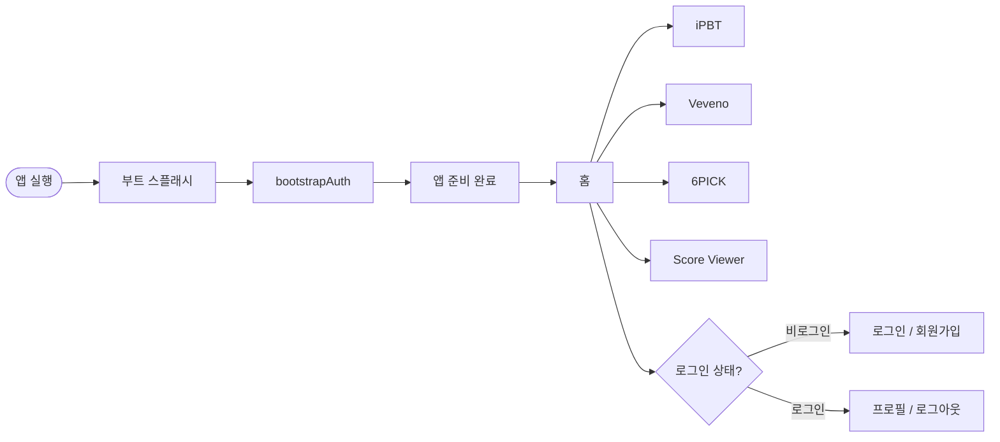

---

## 1. 회원가입 `/signup`


단계: 닉네임 → 이메일 인증 → 비밀번호 → 약관 동의 → 완료 후 `/login`

---

## 2. 로그인 `/login`

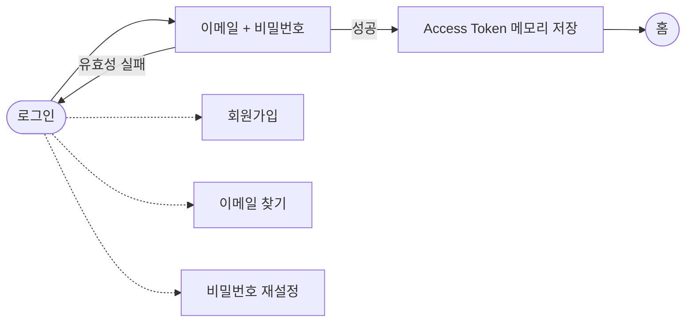

---

## 3. 이메일 찾기 `/find-email`

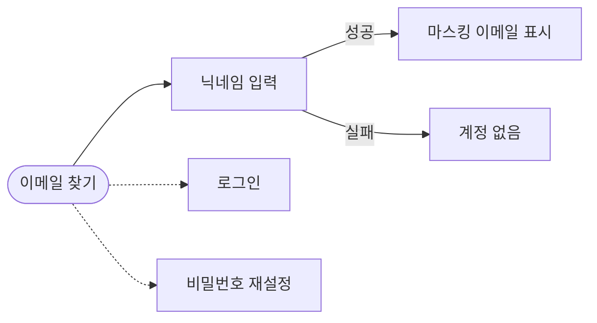

---

## 4. 비밀번호 재설정 `/reset-password`

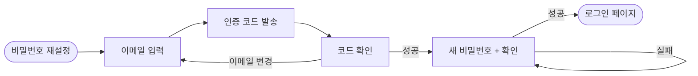

단계: 이메일 → 코드 검증 → 새 비밀번호 → `/login`

---

## 4-1. 비밀번호 변경 (로그인) `/profile/change-password`

FigJam **3-1. 비밀번호 변경** — 로그인된 사용자 전용. 비로그인 `/reset-password`와 별개.

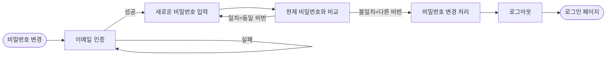

단계: 프로필 → 이메일 인증 → 새 비밀번호 → 서버 동일 비번 거부 → 변경 후 `clearAuth` → `/login`

---

## 5. 프로필 · 로그아웃 `/profile`

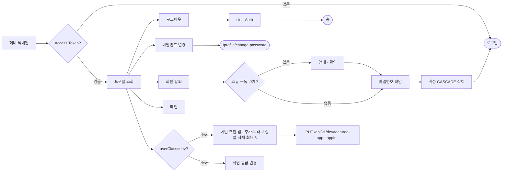

헤더에서도 로그아웃 가능 (로그아웃 후 현재 페이지 유지).  
탈퇴: `DELETE /api/v1/auth/account` + `{ password }`. Veveno **소유·구독** 가게가 있으면 삭제 안내 확인 후 비밀번호 단계 — 탈퇴 시 CASCADE로 함께 정리.  
**dev 전용**: 프로필 dev 패널에서 메인 추천 앱을 **추가 → 드래그(또는 ↑↓)로 순서 지정 → ×로 삭제**, 최대 5개(가득 찬 상태에서 추가하면 마지막 항목이 밀려남). `PUT /api/v1/dev/featured-app`(`{ appIds }`)로 저장 → 전역(`app_config.featured_app_id`, CSV)에 반영. 모든 사용자 메인 상단 캐러셀에 노출되며 여러 개면 자동 로테이션.

---

## 6. 홈 → 취미 앱 진입

```mermaid
flowchart LR
    home([홈]) --> config[GET /api/v1/config/featured-app · appIds]
    config --> featured[추천 캐러셀 · 최대 5개 자동 로테이션 + 좌우 슬라이드]
    home --> sports[스포츠]
    home --> life[라이프]
    home --> music[음악]
    featured --> target[선택된 앱 경로]
    sports --> baseball[/hobbies/ipbt]
    life --> brew[/hobbies/veveno]
    life --> lotto[/hobbies/lotto]
    music --> score[/hobbies/score-viewer]
```

메인 상단 추천 영역은 공개 API `GET /api/v1/config/featured-app`로 앱 id 목록(`appIds`, 최대 5)을 받아 **캐러셀**로 렌더 — 5초 자동 로테이션 + 좌우 화살표·터치 스와이프·dots (1개면 단일 카드, `prefers-reduced-motion` 시 자동 전환 off). 조회 실패·미설정 시 프론트 기본 `ipbt` 폴백(백엔드 폴백 id는 추후 동기화). 값은 dev가 프로필에서 설정.

---

## 7. iPBT

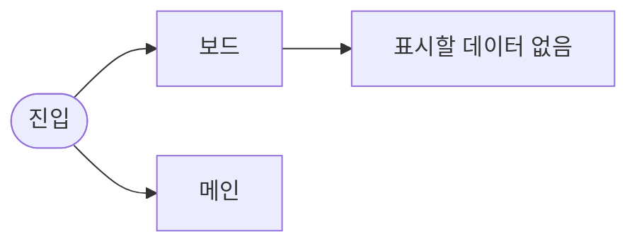

현재 UI 스캐폴드 단계. 날씨로 야구 가능 여부 판정은 미구현.

---

## 8. Veveno (구 Brew Note)

FigJam §8~8-3 + Notion DB 스키마 기준.  
결제(PG/카드) §8-4·8-5는 스키마 미정의로 **미구현**.

### 8-0. 진입 (공개 랜딩 → 로그인 후 허브)

홈·공유 링크는 공개 소개 랜딩 `/hobbies/veveno`(SEO). **시작하기** 후 로그인되면 허브로 이동.

```mermaid
flowchart LR
    home([홈]) --> landing[/hobbies/veveno 랜딩]
    landing -->|"시작하기 · 로그인됨"| hub[허브]
    landing -->|"시작하기 · 비로그인"| login([/login])
    login --> hub
    hub --> register[업장 등록]
    hub --> myStores[내 가게]
    hub --> subs[구독 중]
    hub --> public[공개 가게 · 가입 신청]
    hub --> codeSearch[가게 코드 검색]
```

진입 시 허브/가게에서는 **Veveno 스플래시**(앱 외부에서 진입할 때)를 표시한 뒤 본 화면으로 전환.
옛 경로 `/hobbies/brew-note` → 랜딩, `/hobbies/brew-note/stores/:id` → `/hobbies/veveno/stores/:id` 리다이렉트.

- 설정(owner): **가게 코드** 표시·복사·재발급 (`invite_code` 8자 UNIQUE)
- 허브 검색: 이름 부분일치 + 8자 영숫자면 코드 정확 일치(비공개 포함)

### 8-1. 도메인

`brew_stores` (`invite_code` 8자 UNIQUE) → `brew_menus` → `brew_recipes`  
`brew_store_stock_categories` → `brew_store_stocks`  
`brew_store_subscriptions` (`work_start_date` = 첫 근무일, `leave_date` = 마지막 근무일) + Redis `brew:join:{storeId}:{userId}` (TTL 24h)  
`brew_staff_schedules` (요일 반복 정규 근무, 자정 넘김: `end < start`)
`brew_shift_covers` (날짜 단위 대체·추가, `shift_kind`: COVER|EXTRA)
`brew_store_notices` (가게 공지, owner 작성)

### 8-2. Owner — 메뉴 · 설정

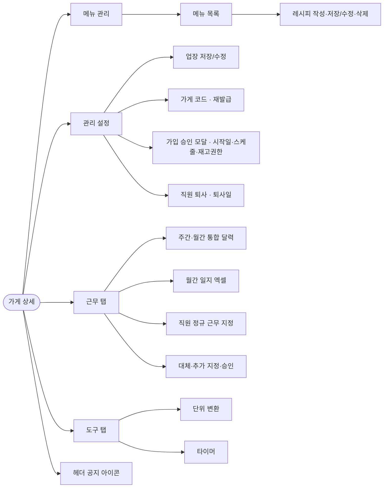

### 8-2b. 도구 (owner·구독자)

프론트 전용 (서버 저장 없음). 탭 이동 중에도 타이머는 모듈 상태로 유지.

- **단위 변환**: 무게(g/kg/oz/lb), 부피(ml/L/cup/fl oz/tbsp/tsp), 온도(°C↔°F), 배율
- **타이머**: 단계 1개면 일반, 2개 이상이면 끝나면 다음 자동 시작. 타이머 여러 개 동시 실행 가능
- 전체 종료 시 비프 패턴 최대 10회 반복. 카드의 **완료**를 누르면 즉시 알람 중단
- **프리셋**: 계정(PERSONAL) / 가게 공용(STORE). owner·구독자 모두 가게 프리셋 CRUD 가능 (`brew_timer_presets`)

### 8-3. 재고 (수정 권한자만)


- `brew_store_subscriptions.can_edit_stock = 1` 또는 owner만 재고 탭 표시
- **수정**은 owner이거나 (권한 ON **그리고** 현재 근무 중 — 본인 정규 또는 승인 대타). 자정 넘김 근무 포함
- Owner는 설정 → 구독자 · 재고 권한에서 부여
- 카테고리: **편집** 모드에서만 추가·이름 수정·삭제 (레시피 목록과 동일 패턴)

### 8-3b. 근무 · 대체·추가

대체(`COVER`)와 추가(`EXTRA`)는 승인 흐름을 공유하되, EXTRA는 **추가 근무자만** 지정한다 (`original_user_id` NULL). 직원 EXTRA는 본인이 근무자 → 업주 승인.

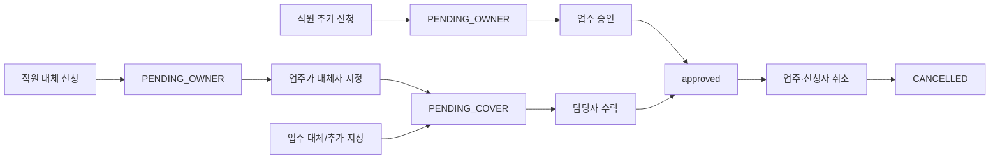

- 업주: 매장 직원 **전원** 스케줄을 하나의 주간/월간 달력에서 조회
- 직원: 본인 정규 + 관련 대체/추가만 조회
- **월간 일지 엑셀**: 현재 앵커 월의 예정 근무(정규·대타·추가)를 `.xlsx`로 다운로드. 시트 `일지`(근무자 행 × 1일~말일 + 총 근무시간) + `직원별 요약`(기간 총·월요일 시작 주간별). `COVERED_OUT` 제외. 권한은 달력과 동일
- **COVER**: 직원 신청에서는 대체자를 선택하지 않음. 신청 후 업주가 지정 → 수락
- **EXTRA**: 요청 직원 없음. 업주는 추가 근무자만 지정(수락 대기). 직원은 본인 추가 신청 → 업주 승인
- **승인 후 취소**: 업주·신청자가 `APPROVED`도 취소 가능 → `CANCELLED`. COVER면 원 근무 복귀. 근무 탭 「대체·추가 관리」
- 담당자 지정 제한: 해당 구간에 **정규 근무**(대체로 COVERED_OUT이 아닌 날) 또는 **승인된 대체/추가**가 겹치는 직원은 지정 불가
- `COVER`: 원래 근무자 구간은 COVERED_OUT. `EXTRA`: 추가 근무자 블록만
- 커버 행: `shift_kind` = `COVER` | `EXTRA`; EXTRA면 `original_user_id` NULL

### 8-3c. 공지 (owner·구독자)

- 가게 상세 **우측 상단** 벨 아이콘(텍스트 라벨 없음). 뱃지로 공지 개수 표시
- 클릭 시 모달: 최신순 목록. **owner만** 작성·수정·삭제 (`brew_store_notices`)
- 구독 직원은 열람만

### 8-3d. 퇴사 (leave_date)

`leave_date` = **마지막 근무일**. `오늘 > leave_date` 이면 구독·정규 근무·대기 중 커버를 정리하고 구독 행을 삭제한다.

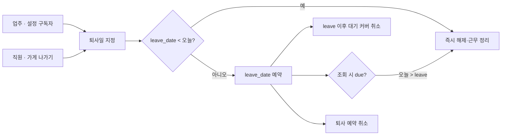

- 업주: 설정 → 구독자에서 **퇴사** / **퇴사 예약 취소**
- 직원: **근무 탭**의 **가게 나가기** 카드에서 퇴사일 지정·예약 취소
- 퇴사일 **이후**에 대체·추가(PENDING/APPROVED)가 있으면 confirm 후 해당 건 **삭제**. 퇴사일 당일·이전은 유지
- API: `GET .../subscribers/{userId}/covers-after-leave?leaveDate=`, `POST .../subscribers/{userId}/resign`, `DELETE /subscriptions/{storeId}` (+ body `leaveDate`), leave 취소 DELETE들
- `brew_store_subscriptions.work_start_date`: 첫 근무일. 달력·근무 중 판정은 이 날짜부터 (`leave_date`까지)

라우트:
- `/hobbies/veveno` — 공개 소개 랜딩 (SEO)
- `/hobbies/veveno/hub` — 허브 (로그인 필수)
- `/hobbies/veveno/stores/:storeId` — 가게(메뉴·재고·근무·도구·설정·공지). 탭은 `?tab=` 로 유지(새로고침 시 유지)
- 메뉴 탭 **카테고리(메뉴) 목록**: 일반 클릭은 선택(레시피 조회), **편집** 모드에서 클릭 시 이름 수정·삭제 모달
- 하위 호환: `/hobbies/brew-note` → 랜딩, `/hobbies/brew-note/stores/:id` → veveno stores

---

## 9. 6PICK

Firebase 로또 앱(6PICK)을 MySQL로 이식. PBB 기존 로그인 유지(Google OAuth 없음).  
진입 시 **6PICK 스플래시**(로고)를 표시한 뒤 본 화면으로 전환.  
당첨 번호 **자동 동기화 구현**: 매주 **토요일 21:00~23:50 KST 10분 간격** 스케줄러가 동행복권에서 최신 회차를 가져와 저장(성공 시 다음 틱 자동 no-op). DEV 수동 등록/엑셀도 병행.

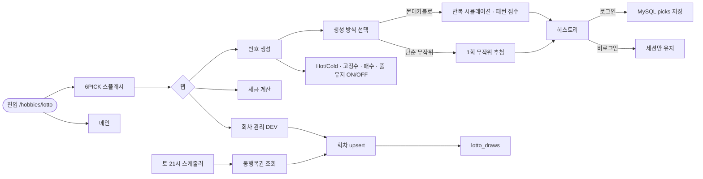

- 공개: 회차 목록 조회, 번호 생성·세금 계산
- 자동 동기화: 토요일 스케줄러가 동행복권 최신 회차를 `lotto_draws`에 upsert (Redis 락으로 중복 방지)
- 번호 생성 방식 선택: **몬테카를로**(반복 시뮬레이션+패턴 점수) / **단순 무작위**(1회 추첨)
- 추첨 번호 풀 유지 **ON/OFF**: ON이면 이전 추첨 번호 제외+자동 리셋, OFF이면 매 게임 1~45 전체에서 추첨(중복 허용)
- 로그인: 생성 히스토리 `lotto_user_picks` 저장
- DEV(`userClass=dev`): 회차 수동 등록·수정, **엑셀(.xlsx) 일괄 가져오기**(회차·본번호 + 보너스·추첨일·1등 금액·1등 당첨자수 추출, 자동동기화와 동일 필드), 몬테카를로 반복 횟수 조절
- 엑셀 일괄 저장(replace)은 **병합 보존**: 업로드에 없는 필드는 기존(자동동기화로 채워진) 값을 덮어쓰지 않고 유지

---

## 10. Score Viewer

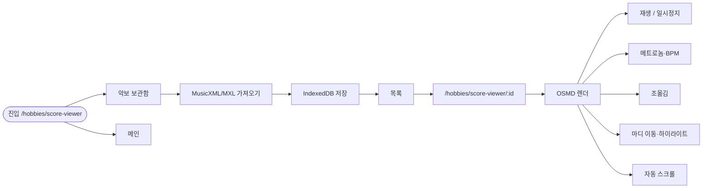

보관함에서 악보를 선택한 뒤 연습 뷰어로 진입한다. 광고·클라우드 구독은 이식하지 않음(로컬 IndexedDB만).

---

## 11. 세션 유지 (백그라운드)

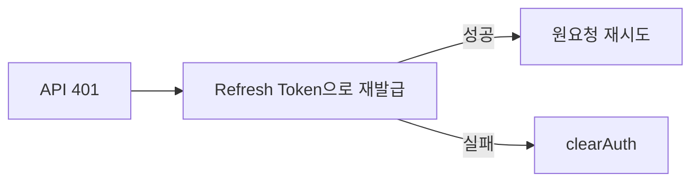

---

## 12. 상태 화면 (점검중 · 오류 · 404)

문제가 생기면 어느 페이지에서든 공용 상태 화면(`StatusView`)으로 전환한다.

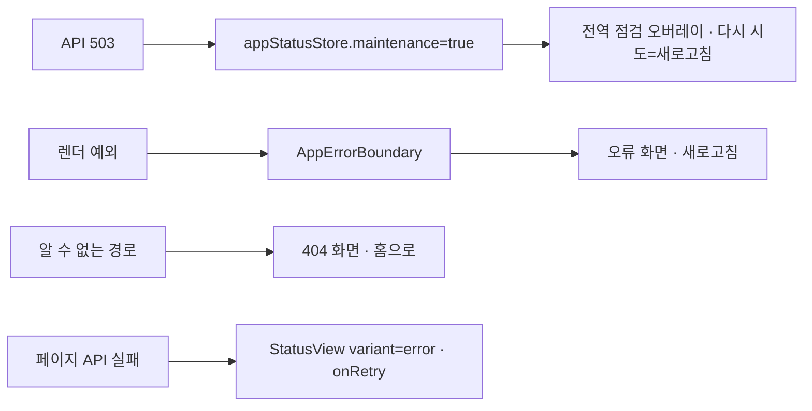

- **점검중**: axios가 `503`을 감지하면 `appStatusStore`에 점검 플래그를 세우고, 모든 화면 위에 전역 점검 오버레이를 덮는다. 서버 메시지가 있으면 함께 표시. `/maintenance` 라우트로 직접 이동도 가능.
- **오류**: 예기치 못한 렌더 예외는 `AppErrorBoundary`가 잡아 오류 화면으로 대체(새로고침 버튼). `/error` 라우트로 직접 이동 가능. 개별 페이지는 API 실패 시 `<StatusView variant="error" onRetry={refetch} />`로 인라인 처리 가능.
- **404**: 정의되지 않은 경로(`*`)는 리다이렉트 대신 404 화면(홈으로 이동)을 보여준다.

공용 컴포넌트: `frontend/src/components/StatusView.tsx` (`variant: maintenance | error | notFound`, props `title/message/detail/onRetry/showHome/fullscreen`).

---

## 라우트 요약

| 경로 | 기능 | 인증 |
|------|------|------|
| `/` | 홈 · 취미 앱 스토어 | 선택 |
| `/signup` | 회원가입 | 불필요 |
| `/login` | 로그인 | 불필요 |
| `/find-email` | 이메일 찾기 | 불필요 |
| `/reset-password` | 비밀번호 재설정 | 불필요 |
| `/profile` | 프로필 · 로그아웃 | **필수** |
| `/profile/change-password` | 비밀번호 변경 (로그인) | **필수** |
| `/hobbies/ipbt` | iPBT (오늘 야구 경기가 있을까?) | 선택 |
| `/hobbies/veveno` | Veveno 소개 랜딩 | 불필요 (SEO) |
| `/hobbies/veveno/hub` | Veveno 허브 | **필수** |
| `/hobbies/veveno/stores/:storeId` | 가게(메뉴·재고·근무·도구·설정·공지) | **필수** |
| `/hobbies/lotto` | 6PICK (로또 번호·세금·회차 DEV) | 선택(히스토리 저장은 로그인) |
| `/hobbies/score-viewer` | 악보 보관함 | 선택 |
| `/hobbies/score-viewer/:id` | 악보 연습 뷰어 | 선택 |
| `/maintenance` | 서버 점검중 화면 | 불필요 |
| `/error` | 오류 화면 | 불필요 |
| `*` (그 외) | 404 페이지를 찾을 수 없음 | 불필요 |
