# PBB 기능별 유저 흐름도

기준: 현재 프론트엔드 라우트·화면 구현 (`frontend/src`)  
FigJam: [PBB 유저 흐름도](https://www.figma.com/board/7VmuTicHtscXPF1VJ91B9J/PBB-%EC%9C%A0%EC%A0%80-%ED%9D%90%EB%A6%84%EB%8F%84)

> FigJam은 Design처럼 페이지가 없어 **기능별 섹션**으로 분리해 두었습니다.  
> 좌측 레이어/섹션 목록에서 `0.~8.` · Score Viewer · **13. Dieta** · **14. 슈란코** 등 섹션을 클릭하면 해당 흐름으로 이동합니다.

> 취미 앱(Score Viewer 랜딩/본체)과 **Veveno·슈란코·Score Viewer 소개 랜딩**은 **비로그인 진입 가능**.
> **6PICK·Dieta**는 DEV 회원만 홈·탭·URL 진입. 그 외는 `/`로 보냄.
> Veveno **실가게**·슈란코 **옷장·룩**·**프로필**은 Access Token 필요 (없으면 `/login` 리다이렉트).
> Veveno **허브** `/hobbies/veveno/hub`는 비로그인 가능(「로그인 전」·계산대 QR 모달). **로컬 체험** `/hobbies/veveno/stores/demo`도 비로그인(이 기기 `localStorage`).

---

## 0. 앱 부트 · 전체 맵

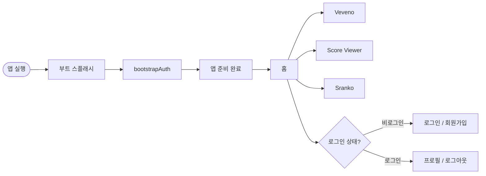
```mermaid
flowchart LR
    start([앱 실행]) --> splash[부트 스플래시]
    splash --> boot[bootstrapAuth]
    boot --> ready[앱 준비 완료]
    ready --> home[홈]

    home --> brew[Veveno]
    home --> score[Score Viewer]
    home --> sranko[Sranko]
    home --> authCheck{로그인 상태?}
    authCheck -->|"비로그인"| loginEntry[로그인 / 회원가입]
    authCheck -->|"로그인"| profileEntry[프로필 / 로그아웃]
```

---

## 1. 회원가입 `/signup`

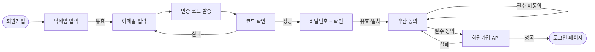
```mermaid
flowchart LR
    start([회원가입]) --> nick[닉네임 입력]
    nick -->|"유효"| emailStep[이메일 입력]
    emailStep --> sendCode[인증 코드 발송]
    sendCode --> verifyCode[코드 확인]
    verifyCode -->|"실패"| emailStep
    verifyCode -->|"성공"| pwd[비밀번호 + 확인]
    pwd -->|"유효·일치"| consent[약관 동의]
    consent -->|"필수 미동의"| consent
    consent -->|"필수 동의"| signupApi[회원가입 API]
    signupApi -->|"성공"| loginPage([로그인 페이지])
    signupApi -->|"실패"| consent
```

단계: 닉네임 → 이메일 인증 → 비밀번호 → 약관 동의 → 완료 후 `/login`

---

## 2. 로그인 `/login`

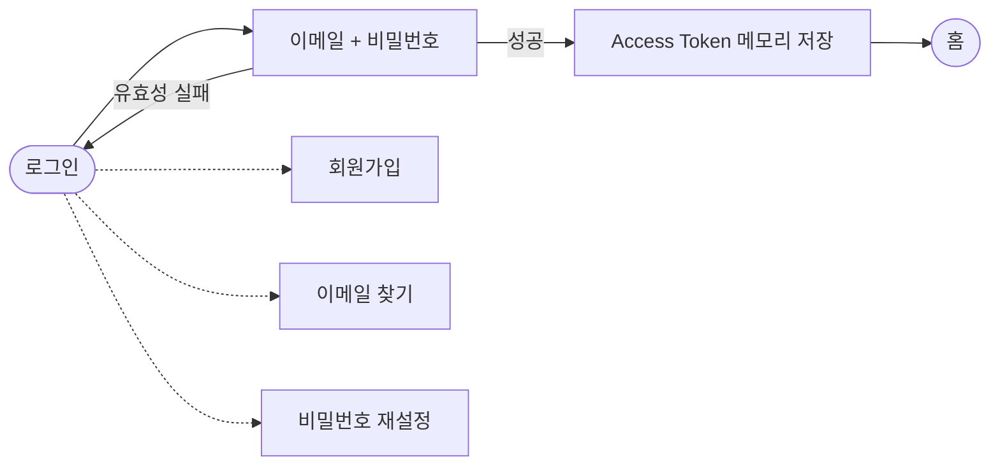
```mermaid
flowchart LR
    start([로그인]) --> form[이메일 + 비밀번호]
    form -->|"유효성 실패"| start
    form -->|"성공"| store[Access Token 메모리 저장]
    store --> home([홈])
    start -.-> signup[회원가입]
    start -.-> findEmail[이메일 찾기]
    start -.-> resetPw[비밀번호 재설정]
```

---

## 3. 이메일 찾기 `/find-email`

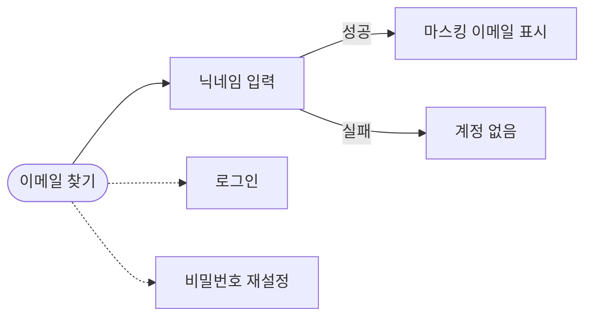
```mermaid
flowchart LR
    start([이메일 찾기]) --> nick[닉네임 입력]
    nick -->|"성공"| masked[마스킹 이메일 표시]
    nick -->|"실패"| err[계정 없음]
    start -.-> login[로그인]
    start -.-> resetPw[비밀번호 재설정]
```

---

## 4. 비밀번호 재설정 `/reset-password`

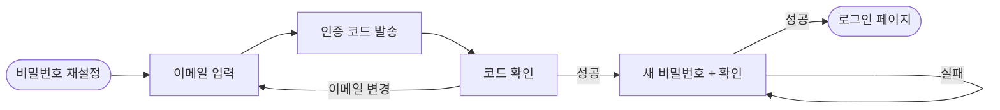
```mermaid
flowchart LR
    start([비밀번호 재설정]) --> emailStep[이메일 입력]
    emailStep --> sendCode[인증 코드 발송]
    sendCode --> verify[코드 확인]
    verify -->|"이메일 변경"| emailStep
    verify -->|"성공"| newPwd[새 비밀번호 + 확인]
    newPwd -->|"성공"| loginPage([로그인 페이지])
    newPwd -->|"실패"| newPwd
```

단계: 이메일 → 코드 검증 → 새 비밀번호 → `/login`

---

## 4-1. 비밀번호 변경 (로그인) `/profile/change-password`

FigJam **3-1. 비밀번호 변경** — 로그인된 사용자 전용. 비로그인 `/reset-password`와 별개.

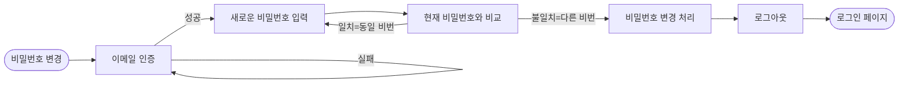
```mermaid
flowchart LR
    start([비밀번호 변경]) --> emailAuth[이메일 인증]
    emailAuth -->|"실패"| emailAuth
    emailAuth -->|"성공"| newPwd[새로운 비밀번호 입력]
    newPwd --> compare[현재 비밀번호와 비교]
    compare -->|"일치=동일 비번"| newPwd
    compare -->|"불일치=다른 비번"| change[비밀번호 변경 처리]
    change --> logout[로그아웃]
    logout --> login([로그인 페이지])
```

단계: 프로필 → 이메일 인증 → 새 비밀번호 → 서버 동일 비번 거부 → 변경 후 `clearAuth` → `/login`

---

## 5. 프로필 · 로그아웃 `/profile`

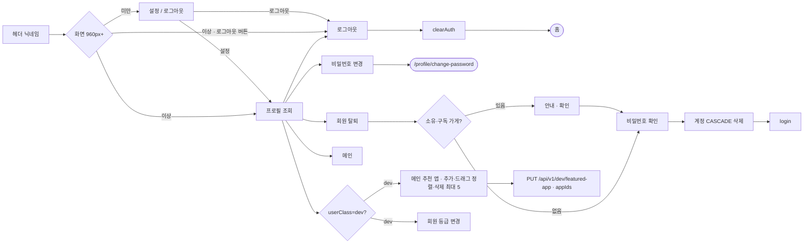
```mermaid
flowchart LR
    nickClick[헤더 닉네임] --> width{화면 960px+}
    width -->|"미만"| accountMenu[설정 / 로그아웃]
    accountMenu -->|"설정"| profile[프로필 조회]
    accountMenu -->|"로그아웃"| logout[로그아웃]
    width -->|"이상"| profile
    width -->|"이상 · 로그아웃 버튼"| logout
    profile --> logout
    logout --> clear[clearAuth]
    clear --> home([홈])
    profile --> changePw[비밀번호 변경]
    changePw --> changePwPage(["/profile/change-password"])
    profile --> withdraw[회원 탈퇴]
    withdraw --> veveno{소유·구독 가게?}
    veveno -->|"있음"| warn[안내 · 확인]
    warn --> pw[비밀번호 확인]
    veveno -->|"없음"| pw
    pw --> deleted[계정 CASCADE 삭제]
    deleted --> login
    profile --> homeLink[메인]
    profile --> devPanel{userClass=dev?}
    devPanel -->|"dev"| featuredSet[메인 추천 앱 · 추가·드래그 정렬·삭제 최대 5]
    devPanel -->|"dev"| classSet[회원 등급 변경]
    featuredSet --> featuredSave[PUT /api/v1/dev/featured-app · appIds]
```

헤더 로그아웃: **960px 이상**은 닉네임(프로필) + 로그아웃 버튼. **미만**은 로그아웃 버튼을 숨기고 닉네임(없으면 「계정」)을 누르면 설정(`/profile`)·로그아웃을 고른다. Veveno(허브·가게)에서는 **Veveno 랜딩**(`/hobbies/veveno`), Dieta는 `/hobbies/dieta`, 슈란코는 `/hobbies/sranko`, 그 외는 **홈 `/`**으로 이동. 직전 경로는 `state.from`에 남겨 재로그인 시 복귀. 로그아웃 중에는 페이지 가드의 `/login` 리다이렉트를 잠시 억제한다.  
탈퇴: `DELETE /api/v1/auth/account` + `{ password }`. Veveno **소유·구독** 가게가 있으면 삭제 안내 확인 후 비밀번호 단계 — 탈퇴 시 CASCADE로 함께 정리. 완료 후 **홈 `/`**.  
**dev 전용**: 프로필 dev 패널에서 메인 추천 앱을 **추가 → 드래그(또는 ↑↓)로 순서 지정 → ×로 삭제**, 최대 5개(가득 찬 상태에서 추가하면 마지막 항목이 밀려남). `PUT /api/v1/dev/featured-app`(`{ appIds }`)로 저장 → 전역(`app_config.featured_app_id`, CSV)에 반영. 모든 사용자 메인 상단 캐러셀에 노출되며 여러 개면 자동 로테이션.

---

## 6. 홈 → 취미 앱 진입

```mermaid
flowchart LR
    home([홈]) --> tabs[상단 탭 · 취미 바로가기]
    home --> hero[고정 브랜드 히어로 · 취미 둘러보기]
    hero --> apps["#apps color-block 스크롤"]
    home --> config[GET /api/v1/config/featured-app · appIds]
    config --> order[featured → 풀폭 블록 순서]
    apps --> brew[/hobbies/veveno]
    apps --> lotto[/hobbies/6pick]
    apps --> dieta[/hobbies/dieta]
    apps --> sranko[/hobbies/sranko]
    apps --> score[/hobbies/score-viewer]
    tabs --> target[선택된 앱 경로]
    order --> apps
```

홈은 Figma 마케팅형 에디토리얼 레이아웃이다.
- **상단 탭**: 흰 글로벌 내비에 공개 취미 앱 링크 + 계정(로그인/가입. 960px 이상은 닉네임/로그아웃, 미만은 닉네임 메뉴에서 설정/로그아웃). 960px 미만은 햄버거 드로어.
- **히어로**: 고정 브랜드 카피 + CTA「취미 둘러보기」(`#apps` 앵커)·「가입하기». 앱 자동 로테이션 없음.
- **marquee**: 검정 스트립에 공개 앱 이름.
- **color-block**: 앱별 파스텔 블록. 공개는 Veveno / Sranko / Score Viewer. 6PICK·Dieta는 DEV만.「시작하기」→ `startPath`.「소개 보기」→ `path`.

---

## 7. iPBT (폐기)

**폐기됨.** `/hobbies/ipbt` 및 레거시 경로(`analyze-baseball`, `pbb`, `/analysis`)는 홈(`/`)으로 리다이렉트.

---

## 8. Veveno (구 Brew Note)

FigJam §8~8-3 + Notion DB 스키마 기준.  
결제(PG/카드) §8-4·8-5는 스키마 미정의로 **미구현**.

### 8-0. 진입 (공개 랜딩 → 로그인 후 허브 / 로컬 체험)

홈·공유 링크는 공개 소개 랜딩 `/hobbies/veveno`(SEO).  
랜딩은 로그인·가게 여부와 관계없이 **항상 표시**(홈「소개 보기」용). **가게 열기** → 허브(`/hub`). 비로그인이면 허브가 「로그인 전」+로그인·「POS 모드 사용」. **사장님으로 써보기** → 로컬 체험 `/hobbies/veveno/stores/demo`(로그인 없음, 이 기기만 저장).  
체험 가게 배너에서 **사장 | 직원** 토글(같은 데이터, 권한만 바뀜). 직원 보기에서는 메뉴 편집·발주 URL이 숨겨진다. **설정 탭은 언어용으로 열리고**, 업장·직원 설정은 사장님만 본다. 시드 에티오피아는 사용량 예측으로 **곧 부족**(약 2일분). 수량을 충분히 올리면 뱃지가 사라진다. **체험 끝내기**는 시드를 초기화하고 랜딩으로 돌아간다.  
허브의 **가게 목록·검색·등록**과 **실가게** 상세는 로그인 필수. 비로그인 허브는 목록 없이 로그인/계산대만. 헤더: 열람자 본인이 해당 가게 **현재 근무 구간**이면 「근무중」 뱃지(업주·직원 공통, 정규·승인 대타/추가·자정 넘김). `onDuty`는 업주도 스케줄 기준(상시 true 아님). 재고 수정은 업주 상시, 직원은 `canEditStock`+근무 중.  
허브 가게 카드: 오늘 **due**인 오픈·마감만 `오픈 3/8 · 마감 아직`(0=아직, 전부=완료). 근무가 아니면 줄 없음.

**언어** (`ko` / `en` / `ja`, 칩 라벨은 항상 한국어 / English / 日本語): 첫 방문은 `navigator.languages` → `navigator.language`에서 지원 태그를 고르고, 없으면 `ko`. **칩·설정에서 고른 뒤에만** `localStorage` `veveno:lang`에 저장한다(그 전엔 방문마다 브라우저를 따른다). 전환 위치: 랜딩 칩, 허브 상단, 가게 설정(사장·직원·체험 공통). 계정/가게 DB 언어·첫 방문 모달 없음. 날짜 표시는 `ko-KR` / `en-US` / `ja-JP`, 영업일 기준은 Asia/Seoul. 사용자가 적은 가게·메뉴·재고 이름은 번역하지 않는다.

```mermaid
flowchart LR
    home([홈]) --> landing[/hobbies/veveno 랜딩]
    landing -->|"가게 열기"| hub[허브]
    landing --> langChips[언어 칩]
    langChips --> landing
    landing -->|"사장님으로 써보기"| demo[로컬 체험 /stores/demo]
    demo -->|"사장 / 직원 토글"| demo
    demo --> demoLang[설정 · 언어]
    demoLang --> demo
    demo -->|"체험 끝내기"| landing
    hub -->|"로그인 전 · 로그인"| login([/login])
    hub -->|"로그인 전 · 계산대"| posQr[QR 모달]
    login --> hub
    hub --> register[업장 등록]
    hub --> myStores[내 가게]
    myStores --> todayLine[오픈 n/m · 마감 아직]
    hub --> subs[구독 중]
    subs --> todayLine
    hub --> public[공개 가게 · 가입 신청]
    hub --> codeSearch[가게 코드 검색]
```

진입 시 허브/가게에서는 **Veveno 스플래시**(앱 외부에서 진입할 때)를 표시한 뒤 본 화면으로 전환.
옛 경로 `/hobbies/brew-note` → 랜딩, `/hobbies/brew-note/stores/:id` → `/hobbies/veveno/stores/:id` 리다이렉트.

- 설정: **언어** 카드(사장·직원·체험 공통, 이 기기만). owner는 이어서 **가게 코드** 표시·복사·재발급 (`invite_code` 8자 UNIQUE)
- 허브 검색: 이름 부분일치 + 8자 영숫자면 코드 정확 일치(비공개 포함)

### 8-1. 도메인

`brew_stores` (`invite_code` 8자 UNIQUE) → `brew_menus` → `brew_recipes`  
`brew_store_stock_categories` → `brew_store_stocks`  
`brew_store_subscriptions` (`work_start_date` = 첫 근무일, `leave_date` = 마지막 근무일) + Redis `brew:join:{storeId}:{userId}` (TTL 24h)  
`brew_staff_schedules` (요일 반복 정규 근무 버전 `effective_from`/`active`, 자정 넘김: `end < start`)  
`brew_staff_schedule_overrides` (하루 예외 · 한번만 변경)  
`brew_shift_covers` (날짜 단위 대체·추가, `shift_kind`: COVER|EXTRA)
`brew_store_notices` (가게 공지, owner 작성)
`brew_checklist_templates` → `brew_checklist_items` / `brew_checklist_runs` → `brew_checklist_checks` (할 일. N+1 없이 template IN → items IN → runs IN → checks IN)

### 8-2. Owner — 메뉴 · 설정

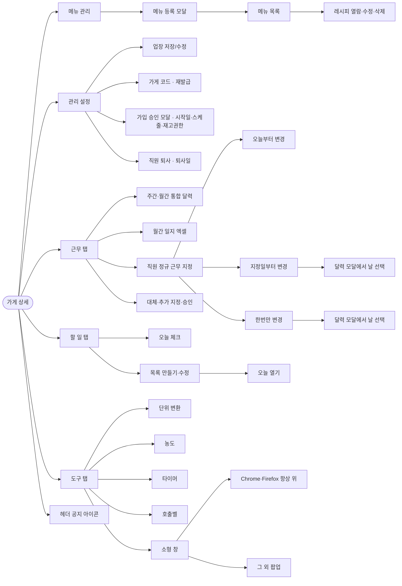
```mermaid
flowchart LR
    store([가게 상세]) --> menus[메뉴 관리]
    menus --> addMenu[메뉴 등록 모달]
    addMenu --> menuList[메뉴 목록]
    menuList --> recipeEdit[레시피 열람·수정·삭제]
    store --> settings[관리 설정]
    settings --> saveStore[업장 저장/수정]
    settings --> inviteCode[가게 코드 · 재발급]
    settings --> joins[가입 승인 모달 · 시작일·스케줄·재고권한]
    settings --> resign[직원 퇴사 · 퇴사일]
    store --> schedule[근무 탭]
    schedule --> calendar[주간·월간 통합 달력]
    schedule --> journalXlsx[월간 일지 엑셀]
    schedule --> assign[직원 정규 근무 지정]
    assign --> fromToday[오늘부터 변경]
    assign --> fromDate[지정일부터 변경]
    fromDate --> pickDate[달력 모달에서 날 선택]
    assign --> once[한번만 변경]
    once --> pickOnce[달력 모달에서 날 선택]
    schedule --> cover[대체·추가 지정·승인]
    store --> checklists[할 일 탭]
    checklists --> todayList[오늘 체크]
    checklists --> templates[목록 만들기·수정]
    templates --> openToday[오늘 열기]
    store --> tools[도구 탭]
    store --> notice[헤더 공지 아이콘]
    tools --> units[단위 변환]
    tools --> concentration[농도]
    tools --> timers[타이머]
    tools --> callbell[호출벨]
    tools --> compact[소형 창]
    compact --> pip[Chrome·Firefox 항상 위]
    compact --> pop[그 외 팝업]
```

- 도구 **소형 창**: Chromium/Firefox Document PiP(항상 위, 같은 탭 state). Safari 등은 `/hobbies/veveno/stores/:storeId/tools`(POS는 `/pos/store/:id/tools`) 팝업. 팝업은 타이머를 창마다 따로 둔다.

- 메뉴 등록: 재고와 같이 모달 한 장. 카테고리(선택 또는 직접 입력) + 제목 + 노트. 카테고리가 없으면 만든 뒤 레시피를 붙인다. 빈 화면 「메뉴 추가」·목록 「새로 추가」·레시피 0 「첫 레시피 적기」가 같은 모달을 연다.

### 8-2c. 할 일 (owner·구독자)

가게 목록(owner)과 개인 목록(본인). 열림: `CLOCK`(서울 시각·요일) / `SHIFT_START` / `SHIFT_END` / `MANUAL`. 조건에 맞는 목록만 **오늘**에 보여 준다. 목록에서 **열기**는 모달에서 체크한다. 하루 1회(`template_id`+`run_on`). 「들어오면 바로 열기」는 미완료 시 모달. **오픈(`SHIFT_START`)만 기본 켜짐**(기존 목록은 그대로). 근무 없는 날 오픈/마감은 안 열림.  
사장님: 가게에 오픈/마감 템플릿이 없으면 샘플 카드. 클릭하면 항목을 고친 뒤 저장. 직원은 샘플 없음.

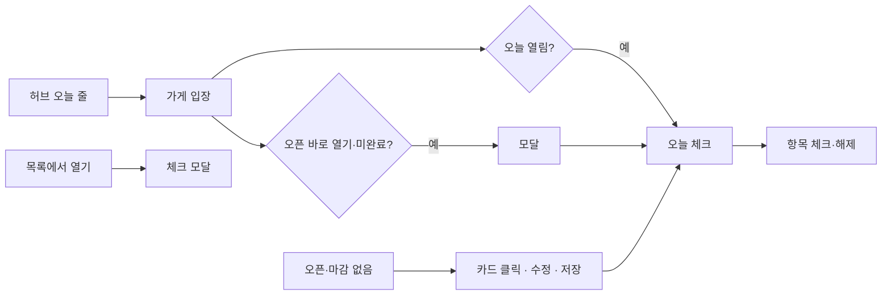
```mermaid
flowchart LR
    hub[허브 오늘 줄] --> enter[가게 입장]
    enter --> interrupt{오픈 바로 열기·미완료?}
    interrupt -->|예| modal[모달]
    enter --> due{오늘 열림?}
    due -->|예| today[오늘 체크]
    modal --> today
    library[목록에서 열기] --> modalCheck[체크 모달]
    today --> check[항목 체크·해제]
    empty[오픈·마감 없음] --> seed[카드 클릭 · 수정 · 저장]
    seed --> today
```

### 8-2b. 도구 (owner·구독자)

단위·농도·타이머는 프론트 계산. 호출벨 멘트·속도·음높이는 가게에 저장. 탭 이동 중에도 타이머는 모듈 상태로 유지.

- **단위 변환**: 무게(g/kg/oz/lb), 부피(ml/L/cup/fl oz/tbsp/tsp), 온도(°C↔°F), 배율
- **타이머**: 단계 1개면 일반, 2개 이상이면 끝나면 다음 자동 시작. 타이머 여러 개 동시 실행 가능
- 전체 종료 시 비프 패턴 최대 10회 반복. 카드의 **완료**를 누르면 즉시 알람 중단
- **프리셋**: 계정(PERSONAL) / 가게 공용(STORE). owner·구독자 모두 가게 프리셋 CRUD 가능 (`brew_timer_presets`)
- **호출벨**: 번호는 매번 입력(엔터=호출). 항상 띵–동 후 `{번호} {멘트}` TTS. 멘트는 비우면 null(번호만). 속도(0.5–2)·음높이(0–2)는 `brew_stores.call_bell_phrase` JSON `{phrase,rate,pitch}`. 구버전 값은 멘트 문자열. TTS는 브라우저 언어. `PUT /api/v1/veveno/stores/{id}/call-bell` (owner·구독자). 번호는 저장하지 않음. 체험은 이 기기 `localStorage`.
- **소형 창**: Chromium/Firefox Document PiP. Safari 등은 `/tools` 팝업.

### 8-3. 재고 (수정 권한자만)

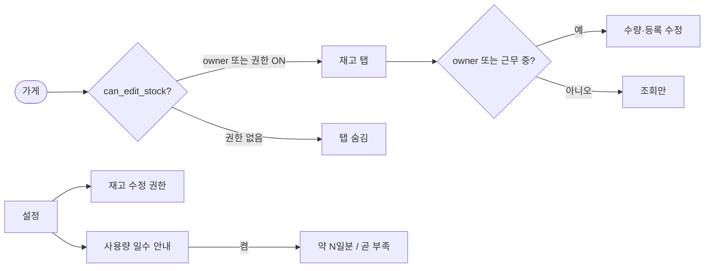
```mermaid
flowchart LR
    store([가게]) --> check{can_edit_stock?}
    check -->|"owner 또는 권한 ON"| stocksTab[재고 탭]
    check -->|"권한 없음"| hide[탭 숨김]
    stocksTab --> duty{owner 또는 근무 중?}
    duty -->|"예"| mutate[수량·등록 수정]
    duty -->|"아니오"| viewOnly[조회만]
    ownerSettings[설정] --> grant[재고 수정 권한]
    ownerSettings --> hint[사용량 일수 안내]
    hint -->|"켬"| days[약 N일분 / 곧 부족]
```

- `brew_store_subscriptions.can_edit_stock = 1` 또는 owner만 재고 탭 표시
- **수정**은 owner이거나 (권한 ON **그리고** 현재 근무 중 — 본인 정규 또는 승인 대타). 자정 넘김 근무 포함. 설정에서 시간 외 재고 조정을 켜면 권한 직원은 근무 외에도 수정 가능
- Owner는 설정 → 구독자 · 재고 권한에서 부여
- 카테고리: **편집** 모드에서만 추가·이름 수정·삭제 (레시피 목록과 동일 패턴)
- 재고 행: `−`/`+`는 1씩. 숫자는 `12개`처럼 단위와 함께 표시. **숫자 탭** → 입고 수량만큼 더함. 목록 헤더 **편집** → 행 `⋯`에서 이름·카테고리·수량·단위·경고선 수정·삭제. **발주 링크는 사장만**(직원 GET 응답에 `orderUrl` 없음, PATCH로도 못 넣음)
- 단위: 기본 선택 `개` / `g` / `kg` / `ml` / `L` / `팩` / `박스`. **직접 입력**은 카테고리와 같이 텍스트 칸(최대 16자). 사장에게 발주 URL이 있으면 행에 **발주** (새 탭, http/https만)
- 수량이 바뀔 때만 `brew_store_stock_logs`에 기록. 편집 모달 **이력**에서 최근 50건 (`닉네임 · 10→9 · 시각`). 이름·카테고리만 바꾸면 기록 없음
- **사용량 일수 안내**(설정에서 기본 끔): 켜면 감소분(`−` 1개 또는 편집으로 N개 줄임)을 `brew_store_stock_usage_days`에 기록. 같은 날 `+` 1개는 그날 사용 −1. 입고·2개 이상 증가는 기록 없음. 재고 탭에 **약 N일분**, 경고선이 3일 안이면 **곧 부족 · 재고 확인**. 공백 날은 평균에서 제외. 가게 삭제 시 CASCADE

### 8-3b. 근무 · 대체·추가

대체(`COVER`)와 추가(`EXTRA`)는 승인 흐름을 공유하되, EXTRA는 **추가 근무자만** 지정한다 (`original_user_id` NULL). 직원 EXTRA는 본인이 근무자 → 업주 승인.

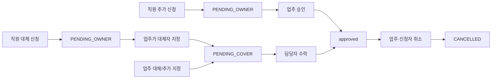
```mermaid
flowchart LR
    empCover[직원 대체 신청] --> pendingOwner[PENDING_OWNER]
    pendingOwner --> ownerAssign[업주가 대체자 지정]
    ownerAssign --> pendingCover[PENDING_COVER]
    ownerDirect[업주 대체/추가 지정] --> pendingCover
    empExtra[직원 추가 신청] --> pendingOwnerExtra[PENDING_OWNER]
    pendingOwnerExtra --> ownerApprove[업주 승인]
    ownerApprove --> approved
    pendingCover --> coverOk[담당자 수락]
    coverOk --> approved
    approved --> cancelApproved[업주·신청자 취소]
    cancelApproved --> cancelled[CANCELLED]
```

- 업주: 매장 직원 **전원** 스케줄을 하나의 주간/월간 달력에서 조회
- 직원: 본인 정규 + 관련 대체/추가만 조회
- **정규 근무 변경**: **오늘부터** / **지정일부터**(주간 템플릿 버전) / **한번만**(그날 예외). 지정일 전은 이전 시간 유지
- **월간 일지 엑셀**: 현재 앵커 월의 예정 근무(정규·대타·추가)를 `.xlsx`로 다운로드. 시트 `일지`(근무자 행 × 1일~말일 + 총 근무시간) + `직원별 요약`(기간 총·월요일 시작 주간별). `COVERED_OUT` 제외. 권한은 달력과 동일
- **COVER**: 직원 신청에서는 대체자를 선택하지 않음. 신청 후 업주가 지정 → 수락
- **EXTRA**: 요청 직원 없음. 업주는 추가 근무자만 지정(수락 대기). 직원은 본인 추가 신청 → 업주 승인
- **승인 후 취소**: 업주·신청자가 `APPROVED`도 취소 가능 → `CANCELLED`. COVER면 원 근무 복귀. 근무 탭 「대체·추가 관리」
- 담당자 지정 제한: 해당 구간에 **정규 근무**(대체로 COVERED_OUT이 아닌 날) 또는 **승인된 대체/추가**가 겹치는 직원은 지정 불가
- `COVER`: 원래 근무자 구간은 COVERED_OUT. `EXTRA`: 추가 근무자 블록만
- 커버 행: `shift_kind` = `COVER` | `EXTRA`; EXTRA면 `original_user_id` NULL

### 8-3c. 공지 (owner·구독자)

- 가게 상세 **우측 상단** 벨 아이콘(텍스트 라벨 없음). 뱃지로 공지 개수 표시
- 클릭 시 모달: 최신순 목록. **owner만** 작성·수정·삭제 (`brew_store_notices`)
- 구독 직원은 열람만

### 8-3d. 퇴사 (leave_date)

`leave_date` = **마지막 정규일**. 구독 해제는 `오늘 > leave_date` **그리고** 잔여 근무(퇴사일 슬롯 + 그 이후 본인이 서는 승인 대타·추가)가 끝난 뒤. 서울 **매시 정각** 배치와 API lazy가 같은 조건.

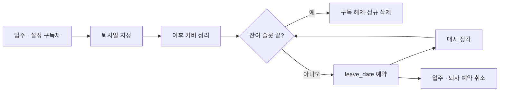
```mermaid
flowchart LR
    pick[퇴사일 지정] --> adjust[이후 커버 정리]
    adjust --> dueCheck{잔여 슬롯 끝?}
    dueCheck -->|예| purge[구독 해제·정규 삭제]
    dueCheck -->|아니오| schedule[leave_date 예약]
    schedule --> hourly[매시 정각]
    hourly --> dueCheck
    owner[업주 · 설정 구독자] --> pick
    schedule --> clear[업주 · 퇴사 예약 취소]
```

- 업주만: 설정 → 구독자에서 **퇴사** / **퇴사 예약 취소**. 직원은 지정·취소 불가(헤더에 예정일만 표시)
- 직원 셀프 API(`DELETE /subscriptions/{storeId}`, `DELETE .../leave`)는 403
- 퇴사일 **이후** 커버: 대타자 있는 퇴사자-original → **추가 근무로 변환**. 본인이 서는 승인 대타·추가 → **유지**(확정 연기). 사람 없는 구인·본인 미승인 → **삭제**. 퇴사일 당일·이전은 유지
- 취소 시 정규는 다시 보이지만, 이미 EXTRA로 바꾼 대타는 되돌리지 않음
- API: `GET .../subscribers/{userId}/covers-after-leave?leaveDate=` (`count/convert/delete/keep`), `POST .../subscribers/{userId}/resign`, `DELETE .../subscribers/{userId}/leave`
- `brew_store_subscriptions.work_start_date`: 첫 근무일. 달력 정규는 이 날짜부터 (`leave_date`까지)

### 8-3e. POS QR 로그인 (계산대)

WhatsApp Web 방식. **계산대**는 비로그인 허브에서 「POS 모드 사용」으로 QR 모달을 연다(`/pos` 북마크는 `/hub?pos=1`). **그 가게에 로그인한 폰**이 헤더 오른쪽(공지 옆) 스캔으로 찍는다. 로그인된 허브·랜딩·비로그인 스캔 없음. 체험 가게는 헤더 「POS 모드 사용」으로 이 탭이 바로 키오스크가 된다.

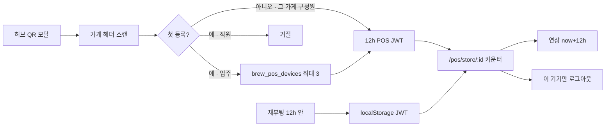
```mermaid
flowchart LR
    posWait["허브 QR 모달"] --> phoneScan[가게 헤더 스캔]
    phoneScan --> ownerEnroll{첫 등록?}
    ownerEnroll -->|"예 · 업주"| whitelist[brew_pos_devices 최대 3]
    ownerEnroll -->|"예 · 직원"| reject[거절]
    ownerEnroll -->|"아니오 · 그 가게 구성원"| session[12h POS JWT]
    whitelist --> session
    session --> counter["/pos/store/:id 카운터"]
    counter --> extend[연장 now+12h]
    counter --> posLogout[이 기기만 로그아웃]
    reboot[재부팅 12h 안] --> restore[localStorage JWT]
    restore --> counter
```

- 미등록 QR에는 storeId 없음. 등록된 POS QR은 그 가게 storeId. 승인은 **지금 들어와 있는 storeId**만 사용.
- 세션은 Redis 12시간, refresh cookie 없음. 같은 deviceId 재연결은 그 기기 세션만 덮어씀. 화이트리스트 3대까지 동시 세션.
- POS JWT(`type=pos`)는 메뉴·레시피·공지 조회, 오늘 할 일, 도구, 재고 조회, 세션 `canEditStock`이면 재고 수정(근무 여부 무시). 설정·초대·근무 관리·메뉴 쓰기는 API에서 거절. UI도 설정·근무 탭 숨김.
- QR 페어 TTL 2분. 계산대는 ~110초마다 새 QR(이전 키는 TTL까지 유지) 후 현재+이전을 폴링.

라우트:
- `/hobbies/veveno` — 공개 소개 랜딩 (SEO, 자동 스킵 없음)
- `/hobbies/veveno/hub` — 허브 (비로그인: 로그인 전 · 계산대 QR 모달 / 로그인: 내 가게)
- `/hobbies/veveno/pos` — `/hub?pos=1`로 보냄 (유효 POS JWT면 카운터)
- `/hobbies/veveno/pos/store/:storeId` — POS 카운터 (POS JWT)
- `/hobbies/veveno/stores/demo` — 로컬 체험 (로그인 불필요, `localStorage`, 사장/직원 토글)
- `/hobbies/veveno/stores/:storeId` — 실가게(메뉴·재고·할 일·근무·도구·설정·공지). 탭은 `?tab=` 로 유지(새로고침 시 유지). `demo`가 아니면 로그인 필수
- `/hobbies/veveno/stores/:storeId/tools` · `/hobbies/veveno/pos/store/:storeId/tools` — 도구 소형 창(팝업 폴백)
- 메뉴 탭 **카테고리(메뉴) 목록**: 일반 클릭은 선택(레시피 조회), **편집** 모드에서 클릭 시 이름 수정·삭제 모달
- 하위 호환: `/hobbies/brew-note` → 랜딩, `/hobbies/brew-note/stores/:id` → veveno stores

---

## 9. 6PICK

DEV 전용. 비DEV·비로그인은 `/hobbies/6pick`·`/play`에서 홈(`/`)으로 보냄.

Firebase 로또 앱(6PICK)을 MySQL로 이식. PBB 기존 로그인 유지(Google OAuth 없음).  
**소개 랜딩** `/hobbies/6pick` → **시작하기**로 `/hobbies/6pick/play` 진입. play 진입 시 **6PICK 스플래시**(로고) 후 본 화면.  
당첨 번호 **자동 동기화 구현**: 매주 **토요일 21:00~23:50 KST 10분 간격** 스케줄러가 동행복권에서 최신 회차를 가져와 저장(성공 시 다음 틱 자동 no-op). DEV 수동 등록/엑셀도 병행.

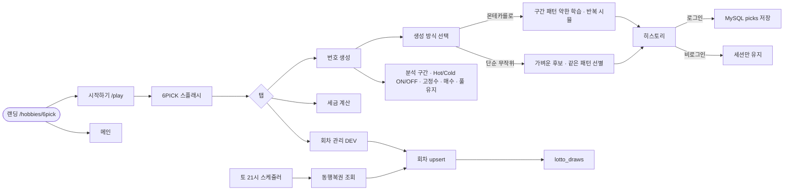
```mermaid
flowchart LR
    landing([랜딩 /hobbies/6pick]) --> play[시작하기 /play]
    play --> splash[6PICK 스플래시]
    splash --> tabs{탭}
    tabs --> draw[번호 생성]
    tabs --> payout[세금 계산]
    tabs --> admin[회차 관리 DEV]
    draw --> mode[생성 방식 선택]
    mode -->|"몬테카를로"| mc[구간 패턴 약한 학습 · 반복 시뮬]
    mode -->|"단순 무작위"| rnd[가벼운 후보 · 같은 패턴 선별]
    draw --> opts[분석 구간 · Hot/Cold ON/OFF · 고정수 · 매수 · 풀 유지]
    mc --> hist[히스토리]
    rnd --> hist
    hist -->|"로그인"| saveApi[MySQL picks 저장]
    hist -->|"비로그인"| localOnly[세션만 유지]
    admin --> upsert[회차 upsert]
    sched[토 21시 스케줄러] --> dhl[동행복권 조회]
    dhl --> upsert
    upsert --> drawsDb[lotto_draws]
    landing --> back[메인]
```

- 공개: 회차 목록 조회, 번호 생성·세금 계산
- 자동 동기화: 토요일 스케줄러가 동행복권 최신 회차를 `lotto_draws`에 upsert (Redis 락으로 중복 방지)
- 번호 생성 방식 선택: **몬테카를로**(선택한 4/8/12/52/전체 구간에서 당첨 패턴을 **구간별 고정 비율**로 반영 + 반복 시뮬) / **단순 무작위**(가벼운 후보 추첨 후 같은 학습 패턴으로 선별, 더 빠름)
- 패턴 반영 비율: 전체 70% · 52주 60% · 12주 50% · 8주 40% · 4주 30% (상한 70%, 회차 없으면 0%)
- 패턴 profile은 **Spring**이 `lotto_draws`로 계산해 Redis(`lotto:pattern:profiles`)에 캐시. FE는 `GET /api/v1/lotto/pattern-profiles`로 받아 채점에만 사용. 회차 upsert/replace/삭제·자동동기화 시 캐시 무효화
- **분석 구간**은 Hot/Cold와 공유. Hot/Cold는 ON/OFF 가능 — OFF면 **패턴만** 적용
- 추첨 번호 풀 유지 **ON/OFF**: ON이면 이전 추첨 번호 제외+자동 리셋, OFF이면 매 게임 1~45 전체에서 추첨(중복 허용)
- 로그인: 생성 히스토리 `lotto_user_picks` 저장
- DEV(`userClass=dev`): 회차 수동 등록·수정, **엑셀(.xlsx) 일괄 가져오기**(회차·본번호 + 보너스·추첨일·1등 금액·1등 당첨자수 추출, 자동동기화와 동일 필드), 몬테카를로 반복 횟수 조절
- 엑셀 일괄 저장(replace)은 **병합 보존**: 업로드에 없는 필드는 기존(자동동기화로 채워진) 값을 덮어쓰지 않고 유지

---

## 10. Score Viewer

공개 소개 랜딩 `/hobbies/score-viewer` → **시작하기**로 보관함 `/library`. 연습 뷰어는 `/hobbies/score-viewer/:id`.

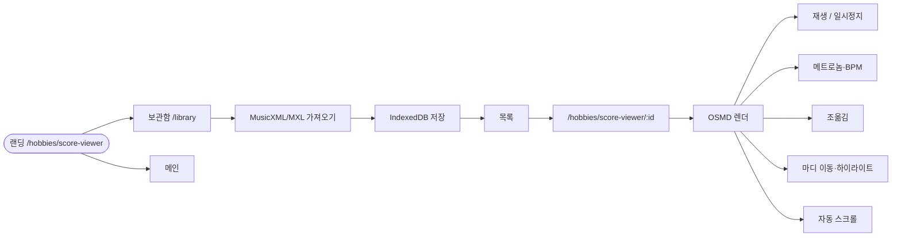
```mermaid
flowchart LR
    landing([랜딩 /hobbies/score-viewer]) --> library[보관함 /library]
    library --> import[MusicXML/MXL 가져오기]
    import --> save[IndexedDB 저장]
    save --> list[목록]
    list --> open["/hobbies/score-viewer/:id"]
    open --> render[OSMD 렌더]
    render --> play[재생 / 일시정지]
    render --> metronome[메트로놈·BPM]
    render --> transpose[조옮김]
    render --> measure[마디 이동·하이라이트]
    render --> scroll[자동 스크롤]
    landing --> back[메인]
```

보관함에서 악보를 선택한 뒤 연습 뷰어로 진입한다. 광고·클라우드 구독은 이식하지 않음(로컬 IndexedDB만).

---

## 11. 세션 유지 (백그라운드)

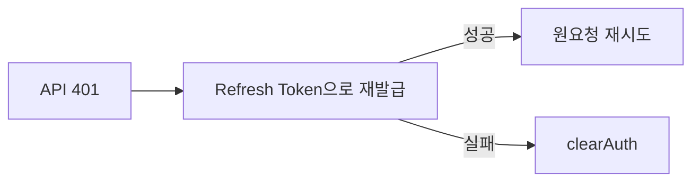
```mermaid
flowchart LR
    api401[API 401] --> refresh[Refresh Token으로 재발급]
    refresh -->|"성공"| retry[원요청 재시도]
    refresh -->|"실패"| clear[clearAuth]
```

---

## 12. 상태 화면 (점검중 · 오류 · 404)

문제가 생기면 어느 페이지에서든 공용 상태 화면(`StatusView`)으로 전환한다.

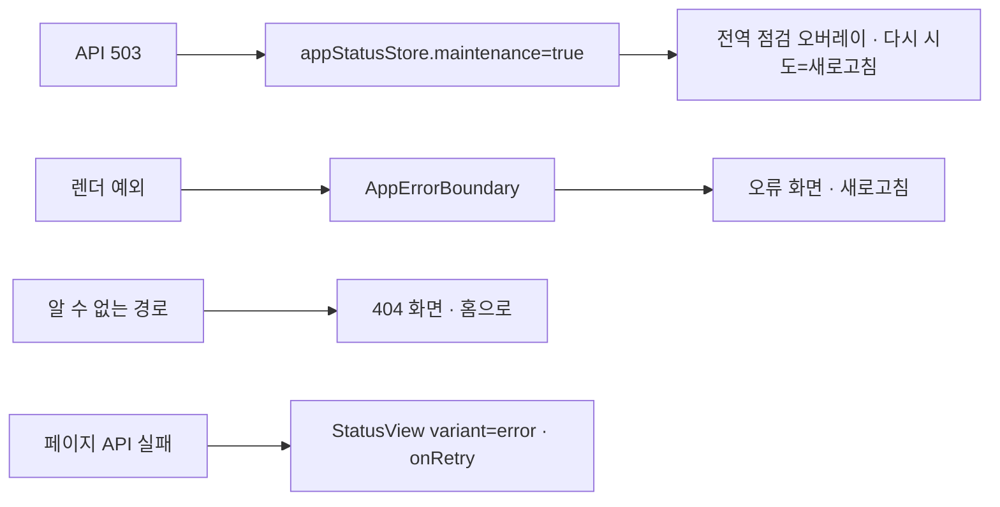
```mermaid
flowchart LR
    api503[API 503] --> maintFlag[appStatusStore.maintenance=true]
    maintFlag --> maintOverlay[전역 점검 오버레이 · 다시 시도=새로고침]
    renderErr[렌더 예외] --> boundary[AppErrorBoundary]
    boundary --> errView[오류 화면 · 새로고침]
    badUrl[알 수 없는 경로] --> notFound[404 화면 · 홈으로]
    pageErr[페이지 API 실패] --> inlineErr["StatusView variant=error · onRetry"]
```

- **점검중**: axios가 `503`을 감지하면 `appStatusStore`에 점검 플래그를 세우고, 모든 화면 위에 전역 점검 오버레이를 덮는다. 서버 메시지가 있으면 함께 표시. `/maintenance` 라우트로 직접 이동도 가능.
- **오류**: 예기치 못한 렌더 예외는 `AppErrorBoundary`가 잡아 오류 화면으로 대체(새로고침 버튼). `/error` 라우트로 직접 이동 가능. 개별 페이지는 API 실패 시 `<StatusView variant="error" onRetry={refetch} />`로 인라인 처리 가능.
- **404**: 정의되지 않은 경로(`*`)는 리다이렉트 대신 404 화면(홈으로 이동)을 보여준다.

공용 컴포넌트: `frontend/src/components/StatusView.tsx` (`variant: maintenance | error | notFound`, props `title/message/detail/onRetry/showHome/fullscreen`).

---

## 13. Dieta

DEV 전용. 비DEV·비로그인은 `/hobbies/dieta/**`에서 홈(`/`)으로 보냄.

체중·리듬 기준 주간 코칭. 본체는 로그인 필수.  
하단 네비: **홈 · 섭취 · 활동 · 설정** (`/progress`는 홈으로 리다이렉트).

### 13-0. 진입 · 온보딩

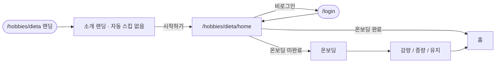
```mermaid
flowchart LR
    enter(["/hobbies/dieta 랜딩"]) --> landing[소개 랜딩 · 자동 스킵 없음]
    landing -->|"시작하기"| homeGate["/hobbies/dieta/home"]
    homeGate -->|"비로그인"| login(["/login"])
    homeGate -->|"온보딩 미완료"| onboard[온보딩]
    homeGate -->|"온보딩 완료"| home[홈]
    login --> homeGate
    onboard --> goalPick[감량 / 증량 / 유지]
    goalPick --> home
```

- 랜딩(`/hobbies/dieta`)은 로그인·온보딩 여부와 관계없이 **항상 표시** (홈「소개 보기」용)
- 온보딩에서 목표 체중(감량·증량)을 두면 **도달 시 자동 MAINTAIN** 전환 안내
- 완료 후 `/hobbies/dieta/home`

### 13-1. 일상 탭

```mermaid
flowchart LR
    home([홈]) --> meals[섭취 · 큐 적재 · 하루 마감 분석]
    meals --> library[등록 음식 모달 · 추가하기/오늘에 더하기]
    home --> activity[활동 기록]
    home --> settings[설정]
    home --> checkinDue{주간 체크인 due?}
    checkinDue -->|"예"| checkin["/check-in"]
    meals --> home
    library --> meals
    activity --> home
```

- 섭취: 큐 적재 · 「등록 음식」(모달 → 선택·mealType·오늘에 더하기 · 「추가하기」=레시피 분석) · 하루 마감 분석
- `/recipes` 북마크는 `/meals`로 redirect
- 섭취 마감 Gemini 응답의 `activityHint`는 **백엔드/분석 JSON**용이며, 별도 화면·유저 단계는 없음 (흐름도 생략)

### 13-2. 주간 체크인 · 다음 주 계획 (`keepTargets`)

홈 또는 `/hobbies/dieta/check-in`. 주 시작 후 7일 경과(8일차)에 due.

```mermaid
flowchart LR
    checkin([주간 체크인]) --> weight[체크인 체중 입력]
    weight -->|"LOSS · 선택"| keto[키토플루 체크]
    weight --> savePlan[저장 · 다음 주 계획 보기]
    keto --> savePlan
    savePlan --> modal[다음 주 계획 모달]
    modal -->|"LOSS · PLATEAU"| plateau{식사 감소 / 활동 증가}
    plateau --> modal
    modal -->|"유지 keepTargets=true"| keep[목표·칼로리 유지 적용]
    modal -->|"체중 기준 조정 keepTargets=false"| adjust[제안 칼로리·활동 적용]
    keep --> nextWeek[다음 주 시작]
    adjust --> nextWeek
```

- 모달 헬퍼: 체중이 같아도 **비체중 신호**에 변동이 있으면 **유지**를 골라도 됨
- 목표 체중 도달 시에는 조정 경로로 MAINTAIN 전환(유지 선택 분기보다 우선)

### 13-3. 설정 · 유지 모드 토글

```mermaid
flowchart LR
    settings([설정]) --> toggle[유지 모드 토글]
    toggle -->|"ON"| maintain[MAINTAIN · 일일=TDEE]
    toggle -->|"OFF"| restore[이전 LOSS 또는 GAIN 복귀]
    auto[목표 체중 도달 · 자동 MAINTAIN] -.-> toggle
    settings --> editTw[목표 체중 · 주간 W 수정]
    settings --> reOnboard[온보딩 다시]
    reOnboard --> confirmWipe[확인 · 데이터 전부 삭제]
    confirmWipe --> resetApi["POST /reset"]
    resetApi --> onboardAgain[온보딩 재시작]
```

- 설정 UI는 **유지 모드 단일 토글** (LOSS/GAIN/MAINTAIN 칩 없음). ON=MAINTAIN, OFF=이전 LOSS|GAIN 복귀
- 목표 체중 도달 시 자동 MAINTAIN은 그대로 적용되며, 이후 토글을 끄면 이전 감량·증량으로 돌아갈 수 있음
- MAINTAIN일 때 일일 목표 = TDEE
- **온보딩 다시**: 확인 후 `POST /api/v1/dieta/reset`로 프로필·체중·섭취·레시피·체크인·식사 큐를 모두 지운 뒤 `/hobbies/dieta/onboarding`으로 이동 (재온보딩은 최초와 동일, 409 없음)

라우트:
- `/hobbies/dieta` — 랜딩 (자동 스킵 없음)
- `/hobbies/dieta/onboarding` — 온보딩 (**로그인 필수**)
- `/hobbies/dieta/home` — 홈 · 주간 체크인 진입
- `/hobbies/dieta/meals` — 섭취 (등록 음식 모달 포함)
- `/hobbies/dieta/recipes` → `/meals` 리다이렉트
- `/hobbies/dieta/activity` — 활동
- `/hobbies/dieta/check-in` — 주간 체크인
- `/hobbies/dieta/settings` — 설정
- `/hobbies/dieta/progress` → `/home` 리다이렉트

---

## 14. 슈란코 (Ŝranko)

공개 랜딩 `/hobbies/sranko`(SEO). **시작하기** → 로그인 시 옷장(`/closet`), 비로그인이면 `/login` + `from=closet`.  
커뮤니티 목록·상세는 게스트 열람 가능 · 작성/MY STYLE·좋아요·댓글 쓰기는 로그인 필수.

### 커뮤니티 (좋아요 · 댓글 · 조회)

```mermaid
flowchart LR
    list[목록 게스트OK] --> detail[상세]
    detail --> bump[POST /read · Redis NX 24h]
    bump --> meta[조회·좋아요·댓글 수]
    detail --> like[POST /like · 로그인]
    detail --> share[공유 · WebShare/클립보드]
    detail --> comments[GET comments flat]
    comments --> reply[답글 2단]
    comments --> cLike[댓글 좋아요]
    write[글쓰기 로그인] --> fileUp[파일 업로드]
    write --> lookPick[GET /looks/picker]
    lookPick --> post[POST /posts · 본인 R2 URL]
    fileUp --> post
```

- Post: `read_count` / `like_count` / `comment_count` 역정규화. 좋아요·댓글좋아요는 조인 테이블 + `±1` UPDATE.
- 게시 이미지: `image_urls` JSON(1–10장) · `image_url`은 커버(첫 장). 목록·상세·글쓰기 미리보기는 카드형 캐러셀.
- 글쓰기 이미지: **파일 업로드** 또는 **「룩에서 선택」** (`GET /looks/picker` · `{ id, name, imageUrl, createdAt }` · 아이템 hydrate 없음). `POST /posts`는 본인 R2 `sranko/{userId}/` URL만 허용.
- 조회: `POST /posts/{id}/read` + `X-Sranko-Viewer`(게스트) 또는 userId · Redis `sranko:post:view:{postId}:{viewerKey}` NX TTL 24h · 실패 시 +1 스킵.
- 공개: `GET /posts`, `GET /posts/{id}`, `GET …/comments`, `POST …/read`. 쓰기는 인증.
- 댓글: flat 로드 · `parentId`만 루트 · N+1 없이 authors/`likedByMe` 배치 IN.

### 옷장 ITEM+ (2단계) · 수정 · 사이즈

```mermaid
flowchart LR
    open([ITEM +]) --> photo[1 사진 선택]
    photo --> worn{착용 사진에서 옷만 추출?}
    worn -->|"아니오"| classify[분류만 · skipRembg]
    worn -->|"예"| target[필수 종류 선택 TOP/BOTTOM/OUTER/DRESS]
    target --> extract[보이는 옷 영역만 분할·투명 PNG]
    extract -->|"마스크 품질 실패"| blocked[경고 · 미리보기 제거 · 저장 차단]
    blocked --> photo
    extract -->|"성공"| details[2 이름·분류·따뜻함·옷사이즈]
    classify -->|"옷아님·실패"| photo
    classify -->|"성공"| details
    details --> rembg[백그라운드 POST /ml/rembg]
    rembg -->|"실패"| details
    rembg -->|"완료"| ready[투명 PNG 미리보기]
    details -->|"사진 다시"| photo
    ready --> save[저장]
    details -->|"rembg 전"| waitSave[저장 비활성]
    cardEdit([카드 · 수정]) --> editDetails[기존 값 프리필 · 2단계]
    editDetails -->|"사진 다시"| photo
    editDetails --> upsert[PUT /items id]
```

옷장 카드: 이미지·이름·분류·따뜻함만 표시(치수·버튼 없음). **카드 클릭 → 상세 모달**(치수 전체 + 입어보기·수정·삭제; 가방/모자/주얼리는 입어보기 없음).
슬롯: TOP·BOTTOM·OUTER·SHOES·DRESS·**BAG·HAT·JEWELRY**. 신발·악세서리는 warmth null · 악세서리는 치수 필드 없음.
옷장 ITEM+: predict가 slot / categoryCode / warmth(1–5, 신발·악세서리는 null) / taxonomyGroup을 프리필. 등록·수정 시 **브랜드·상품 URL(선택)** 저장. **기본 상품 사진**은 `skipBackgroundRemoval`으로 **분류만 먼저** 2단계로 보내고, `POST /ml/rembg`로 배경 제거를 이어 한다(저장은 rembg 완료·PNG 준비 후). 「착용 사진에서 옷만 추출」을 켜면 TOP/BOTTOM/OUTER/DRESS(신발·악세서리 제외)를 먼저 고르고, `POST /api/v1/sranko/ml/predict` multipart의 `extractWornGarment=true`·`targetSlot`로 **한 번에** 요청한다. 성공 시 해당 종류가 classifier보다 우선하며, 사진에 실제로 보이는 의류 픽셀만 crop한 투명 PNG를 사용한다. OUTER는 cloth 모델 한계상 보이는 최외곽 상체 의류 영역이다. 품질 실패는 `garmentExtractionApplied=false`·`extractionWarning`으로 미리보기를 지우고 저장을 막는다. 유저가 대분류·소분류·따뜻함을 수정한 값이 저장·향후 학습 GT. **DRESS 소분류는 소매 타입**(`긴팔`/`반팔`/`민소매`; slot=원피스, 레거시 `원피스`→`긴팔`). BOTTOM 소분류가 기장 스타일(반바지=짧음, 데님·면바지·슬랙스=김, 치마=넓은 허용). DRESS 옷 치수 키는 어깨·가슴·소매길이·허리·엉덩이·총기장 순서.
**수정**: 상세 「수정」→ 등록과 같은 모달에 기존 값 프리필. 사진 미변경 시 기존 `imageUrl` 유지, 변경 시 재업로드 후 `PUT /items`에 `id`로 upsert(이전 R2 이미지 삭제).
**다중 선택 바**: 카드 체크로 아이템 다중 선택 → sticky 바에서 「선택 해제」·「삭제」(확인 후 `DELETE` 일괄)·「룩 입어보기」. **룩 입어보기**: OUTER/TOP/BOTTOM/DRESS/**HAT**/**SHOES** (슬롯당 1 · DRESS↔TOP/BOTTOM 배타 · max 5) → Gemini 풀룩 착용 1장 → `POST /looks` `source=TRY_ON`. 가방·주얼리만 선택된 경우 버튼 비활성. 플랫레이 콜라주(COMPOSE)는 제거(기존 COMPOSE 룩은 조회만 가능).
옷장 **내 사이즈** / **성별(마네킹)**: 헤더 「정보 수정」 모달에서 관리(성별·사이즈 저장/삭제).  
길이 cm 저장(필드별 inch 입력 가능) · 몸무게 kg 저장(필드별 lb 입력 가능) · 발 mm 저장(EU/US 입력 가능). **사이즈 삭제**로 prefs `body_measurements` 전체 비움 → 이후 입어보기는 옷별 핏 선택.

### 입어보기 (Gemini · 단일/멀티)

인물 사진 업로드는 **없음**. 입어보기는 항상 기본 마네킹(핏 맵과 동일 각도 · BE classpath) — prefs `sex`가 `F`면 여자 마네킹, 그 외(미설정 포함)는 남자. 정보 수정에서 성별(남자/여자) 선택 후 「사이즈 저장」으로 `PATCH /prefs` `sex`.

```mermaid
flowchart LR
    tryBtn[입어보기 / 룩 입어보기] --> confirmModal[확인 모달 · 기본 마네킹]
    confirmModal --> consent{동의?}
    consent -->|아니오| stop([중단])
    consent -->|예| bodyOk{신체 사이즈?}
    bodyOk -->|없음| pickFit[옷별 핏 선택 · 슬림/보통/오버]
    pickFit --> sizeFacts[아이템 치수 → Garment sizes 프롬프트]
    sizeFacts --> geminiManual[Gemini · mannequin + fitByItemId + sizes]
    bodyOk -->|있음| fitPre[GET /fit-check · 단일만]
    fitPre --> tight{delta ≤ −4?}
    tight -->|예| tightConfirm[많이 작음 확인]
    tightConfirm -->|취소| stop
    tightConfirm -->|OK| gemini[Gemini · mannequin+N + Δ·sizes 프롬프트]
    tight -->|아니오| gemini
    gemini --> resultModal[결과 모달 JPEG+뱃지]
    geminiManual --> resultModal
    resultModal --> close([닫기 · tryon TTL 1h])
    resultModal --> saveLook[내 룩 저장 · tryon→looks promote]
    resultModal --> retry[다시 → 확인 모달]
```

- 성공 시 확인 모달을 닫고 **결과 모달**을 연다(확인 모달 인라인 결과 없음). 「다시」는 결과만 지우고 같은 아이템 확인 모달로 복귀(자동 재실행 없음).
- **R2 tryon TTL**: `POST /ml/try-on`(및 `uploads?kind=tryon`) 결과를 `…/tryon/…`에 올리고 Redis ZSET으로 **1시간** 후 스케줄 삭제(`sranko.try-on.ephemeral-ttl`). **동일 옷·핏 조건** 재요청 시 Redis 결과 URL 캐시(`sranko.try-on.result-cache-enabled`, TTL=동일 1h)로 Gemini 생략하고 **R2·캐시 TTL을 다시 1시간으로 연장(슬라이딩)**. 「내 룩에 저장」(`POST /looks`) 시 해당 유저 tryon URL이면 **looks/로 복사·TTL 취소·결과 캐시 무효·tryon 삭제** 후 DB에는 looks URL 저장.
- **룩 아이템 hydrate**: `item_ids_json` 유지 · 목록/생성/상세 응답에 `items[]`(이름·슬롯·브랜드·productUrl·썸네일). Look↔Item JPA 연관 없음 · ID 모아 `findByUserIdAndIdIn` **1쿼리** (N+1 방지). 삭제된 아이템은 `missing: true`.
- **룩 상세**: 목록 카드 → **룩 상세 모달**에서 구성 상품 · 상품 클릭 → **상품 상세 모달**. `GET /looks/{id}`는 단건 조회용으로 유지.
- `GET /api/v1/sranko/fit-check?itemId=` · prefs body + 아이템 치수 → `{ fit, muchTooSmall, skipStage2, parts[] }` (primary delta ≤ −4 cm → `muchTooSmall`). `parts[]`: 부위별 `{ key, bodyCm, garmentCm, deltaCm, band }` · 어깨·가슴·허리 등 둘레는 raw Δ · **소매(`armLength`)·하의 기장(`totalLength`↔legLength)은 categoryCode 기준 기대 비율**로 Δ 재계산(반팔·반바지가 항상 매우 타이트로 나오지 않음; 구간 안이면 Δ=0). 전체 입어보기 `analyze`는 소매 길이를 primary에서 제외. TOP/OUTER 어깨·가슴·소매·총장(↔torsoLength), BOTTOM 허리·엉덩이·허벅지·기장, DRESS 어깨·가슴·소매·허리·엉덩이 · SHOES는 빈 배열.
- **핏 맵**: 확인 모달·결과 모달 모두에 마네킹 실루엣(SVG) 바디맵으로 부위별 핏 표시 — 부위별 측정선 + 좌측 콜아웃 필(매우 타이트함 / 타이트함 / 약간 타이트함 / 딱 맞음 / 약간 루즈함 / 루즈함 / 매우 루즈함 / 측정값 없음, 수치 미노출). 결과 사진은 무드 컷, 정확한 사이즈 정보는 핏 맵이 담당. 신체 사이즈 미등록·SHOES·parts 없음이면 미표시.
- `POST /api/v1/sranko/ml/try-on` · preferred `itemIds[]` (OUTER/TOP/BOTTOM/DRESS/**HAT**/**SHOES**, max 5) · legacy `itemId`/`garmentImageUrl` · **항상** classpath 마네킹(`sex=F` → female PNG, 그 외 male) · **신체 치수 있으면** prefs 기반 analyze(Δ·fit) · **없으면** `fitByItemId`로 옷별 `slim|regular|loose`(기본 regular, UI 라벨 슬림/보통/오버; HAT·SHOES는 핏 선택 없음). **아이템 `measurements_json`이 있으면** 신체 유무와 관계없이 프롬프트에 `Garment sizes (product label measurements):`로 절대 치수(cm · 신발 mm)를 첨부. print/logo 사전 분석(`print_meta_json`)은 **제거**.
- `GET /api/v1/sranko/assets/default-person` · 기본 마네킹 PNG (인증 필요 · prefs `sex` 반영).
- prefs: `sex` (`M`|`F`|null) · 정보 수정에서 설정 · null은 남자 마네킹 폴백. `person_image_url` 컬럼 제거.
- 파이프라인: **`garments ≥ 4`이면 다단** — ① OUTER/TOP/BOTTOM(또는 DRESS) 몸통 → ② HAT/SHOES → ③ 나머지(있으면). 빈 묶음 스킵. 몸통 JPEG는 Redis `sranko:tryon:body:*` TTL 15분 캐시(악세만 다시 입을 때 몸통 재호출 생략; dev는 캐시 OFF). `< 4`는 단일 Gemini 호출. 영어 프롬프트(레이어링·기존 옷 제거·기장·컷아웃 + slim/regular/loose + **아이템 절대 사이즈** + body 있으면 Δ + 성별·전신·30° pose). print 사전 분석 없음.
- 결과 뱃지: 슬림/보통/여유 · 많이 작음 시 「타이트 · 옷이 작음」.
### 날씨 · 자주 가는 곳

```mermaid
flowchart LR
    closet[옷장 · 오늘 날씨] --> chips[장소 칩 · 내 위치/검색지/저장장소]
    closet --> preview[GET /places/search → 결과 클릭]
    preview --> weather[GET /weather lat lon]
    chips --> weather
    weather --> show[현재 날씨]
    weather --> hourly[현재부터 12시간 예보]
    profile[정보 수정] --> search[GET /places/search · 집/회사/즐겨찾기]
    search --> save[PATCH /prefs places]
    save --> chips
```

- Spring이 WeatherAPI.com **forecast**를 호출 (현재 + 현지 시각부터 12시간). FE는 WeatherAPI 직접 호출 금지.
- Redis 키 `sranko:forecast:{lat2}:{lon2}` · TTL 30분.
- prefs `places_json`: HOME×1 · WORK×1 · FAVORITE≤5 · `{id,label,kind,lat,lon,query?}`.
- **일회 조회**: 옷장 「오늘 날씨」 검색 → 결과 클릭 → 해당 lat/lon 날씨(prefs 미저장 · 임시 칩).
- **장소 검색 매칭**: BE 로컬 카탈로그(`sranko/place-catalog.json` · 세계 주요 도시·한국 시/구 + 한글 별칭) 우선 → WeatherAPI search 폴백·병합.
- **장소 등록**: 정보 수정 「자주 가는 곳」에서 동일 search API 후 집/회사/즐겨찾기.
- 위치 거부·내 위치만 실패 시 수동 °C (시간별 없음). WeatherAPI free plan 고지 링크 표시.
- ~~오늘 추천 / `GET /recommend`~~ — 제거됨.

```mermaid
flowchart LR
    home([홈]) --> landing[/hobbies/sranko 랜딩]
    landing -->|"시작하기 · 로그인"| closet[옷장]
    landing -->|"시작하기 · 비로그인"| login([/login])
    login --> closet
    landing --> community[커뮤니티]
    closet --> looks[내 룩]
    closet --> community
```

- `/hobbies/sranko` — 랜딩 (SEO)
- `/hobbies/sranko/closet` — 옷장 (**로그인 필수**) · **정보 수정**(사진·사이즈) · 카드 클릭 **상세** · 체크 선택 후 **룩 입어보기**(TRY_ON 룩) · ITEM+ (BAG/HAT/JEWELRY 포함) · **날씨**
- `/hobbies/sranko/looks` — 내 룩 목록 · 상세/상품은 모달 (**로그인 필수**)
- `/hobbies/sranko/community` — 커뮤니티 목록 (게스트 OK)
- `/hobbies/sranko/community/new` · `/mine` — 작성·MY STYLE (**로그인 필수**)
- `/hobbies/sranko/community/:postId` — 상세

---

## 라우트 요약

| 경로 | 기능 | 인증 |
|------|------|------|
| `/` | 홈 · 취미 앱 스토어 | 선택 |
| `/signup` | 회원가입 | 불필요 |
| `/login` | 로그인 | 불필요 |
| `/find-email` | 이메일 찾기 | 불필요 |
| `/reset-password` | 비밀번호 재설정 | 불필요 |
| `/profile` | 프로필 · 로그아웃 | **필수** |
| `/profile/change-password` | 비밀번호 변경 (로그인) | **필수** |
| `/hobbies/ipbt` 등 | (폐기 → `/`) | — |
| `/hobbies/veveno` | Veveno 소개 랜딩 | 불필요 (SEO) |
| `/hobbies/veveno/hub` | Veveno 허브 (게스트=로그인 전·QR 모달) | 목록은 로그인 후 |
| `/hobbies/veveno/pos` | → `/hub?pos=1` (유효 세션이면 카운터) | 불필요 (페어 후 POS JWT) |
| `/hobbies/veveno/pos/store/:storeId` | Veveno POS 카운터 | **POS JWT** |
| `/hobbies/veveno/pos/store/:storeId/tools` | 도구 소형 창 (POS) | **POS JWT** 또는 체험 |
| `/hobbies/veveno/stores/demo` | Veveno 로컬 체험 (사장/직원 토글) | 불필요 |
| `/hobbies/veveno/stores/:storeId` | 실가게(메뉴·재고·할 일·근무·도구·설정·공지) | **필수** (`demo` 제외) |
| `/hobbies/veveno/stores/:storeId/tools` | 도구 소형 창 | 가게와 동일 |
| `/hobbies/6pick` | 6PICK 소개 랜딩 | **DEV** |
| `/hobbies/6pick/play` | 6PICK (로또 번호·세금·회차) | **DEV** |
| `/hobbies/lotto` | → `/hobbies/6pick` 리다이렉트 | **DEV** |
| `/hobbies/score-viewer` | Score Viewer 소개 랜딩 | 선택 |
| `/hobbies/score-viewer/library` | 악보 보관함 | 선택 |
| `/hobbies/score-viewer/:id` | 악보 연습 뷰어 | 선택 |
| `/hobbies/dieta` | Dieta 랜딩 | **DEV** |
| `/hobbies/dieta/onboarding` | Dieta 온보딩 | **필수** |
| `/hobbies/dieta/home` | Dieta 홈 | **필수** |
| `/hobbies/dieta/meals` | Dieta 섭취 (등록 음식 모달) | **필수** |
| `/hobbies/dieta/recipes` | → `/meals` redirect | **필수** |
| `/hobbies/dieta/activity` | Dieta 활동 | **필수** |
| `/hobbies/dieta/check-in` | Dieta 주간 체크인 | **필수** |
| `/hobbies/dieta/settings` | Dieta 설정 | **필수** |
| `/hobbies/sranko` | 슈란코 랜딩 | 불필요 (SEO) |
| `/hobbies/sranko/closet` | 슈란코 옷장 (ITEM+ 2단계) | **필수** |
| `/hobbies/sranko/looks` | 슈란코 내 룩 (상세·상품 모달) | **필수** |
| `/hobbies/sranko/community` | 슈란코 커뮤니티 | 선택 |
| `/hobbies/sranko/community/new` | 게시 작성 | **필수** |
| `/hobbies/sranko/community/mine` | MY STYLE | **필수** |
| `/hobbies/sranko/community/:postId` | 게시 상세 | 선택 |
| `/maintenance` | 서버 점검중 화면 | 불필요 |
| `/error` | 오류 화면 | 불필요 |
| `*` (그 외) | 404 페이지를 찾을 수 없음 | 불필요 |
